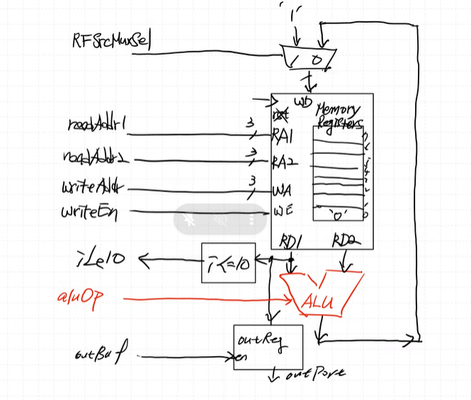
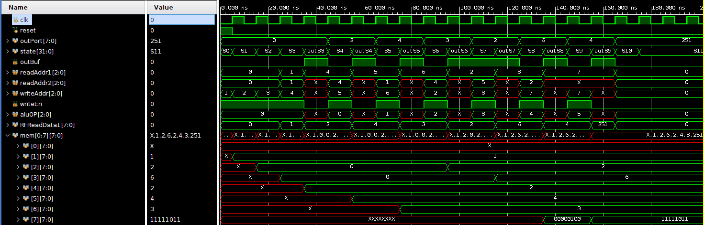

### 설계 변경사항
- adder 만 있던 구조에서 ALU로 확대
> 더욱 더 CPU에 근접하게 되었음

### block diagram

- read는 combinational logic으로 ra1, ra2의 주소의 데이터 값 (rd1, rd2)를 항상 read하는 상태
- we가 1이 되면 writeAddr 주소에 wData로 들어오는 값을 write함
- outReg는 rd1을 d(입력) 으로 받으며 outBuf(en)이 1이 될 때 outPort로 d 값을 넘김

### simulation

register에 어떤 값을 저장하기 위해 1clk(1 state)가 소모되며, 제대로 저장됐는지 확인하기 위해 또 1clk(1 state)가 소모된다.
    - S4에서 add연산 수행 (1clk)
    - outS4에서 ra1에 방금 write했던 주소값 인가, outBuf 1인가 (1clk)
    - 그 다음 outPort로 값을 확인 가능
    