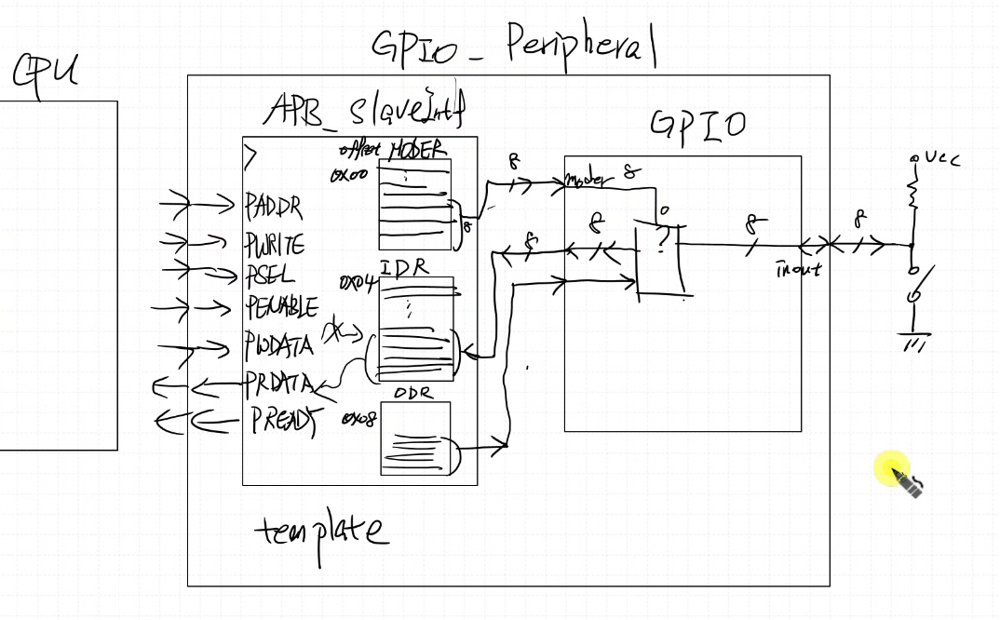
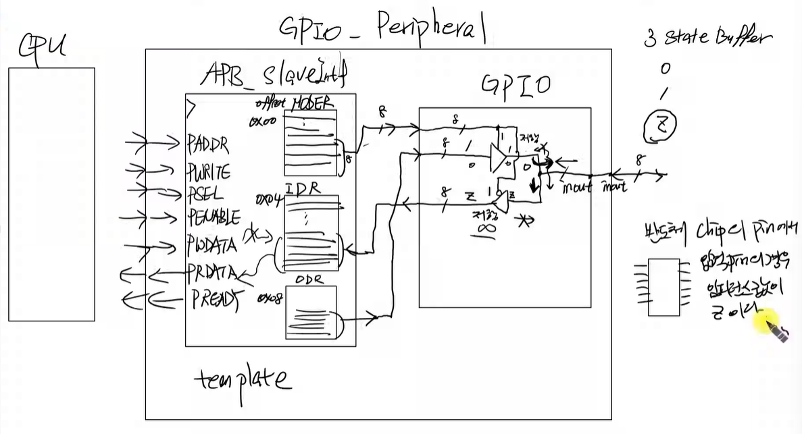
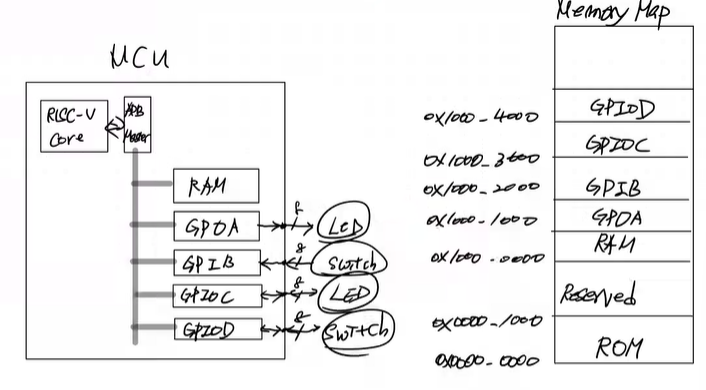
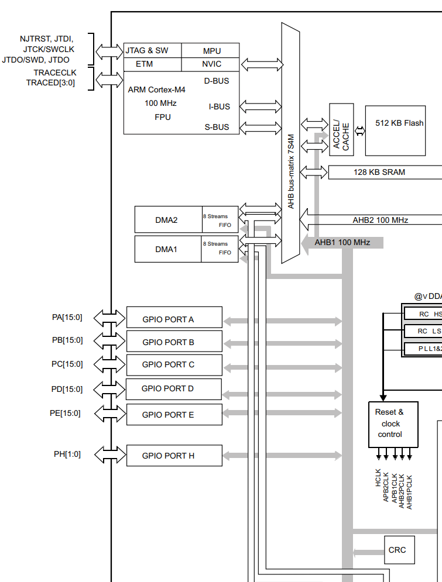
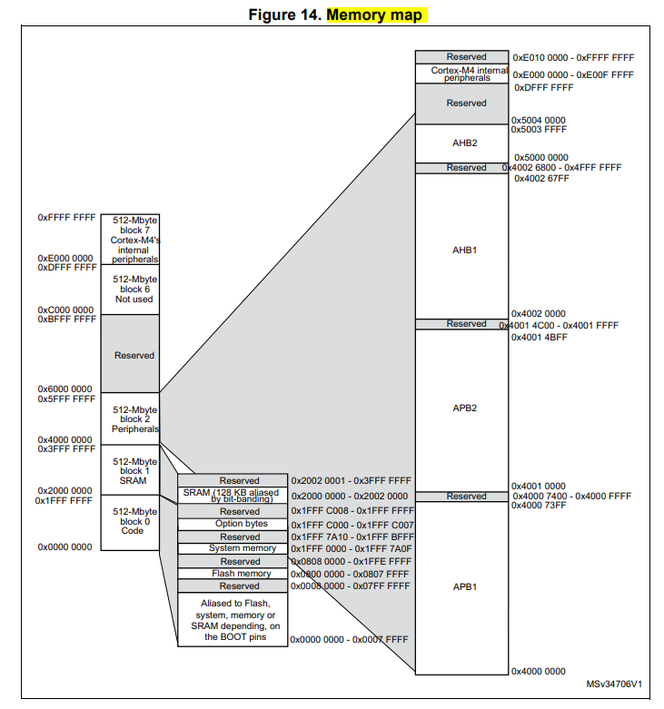
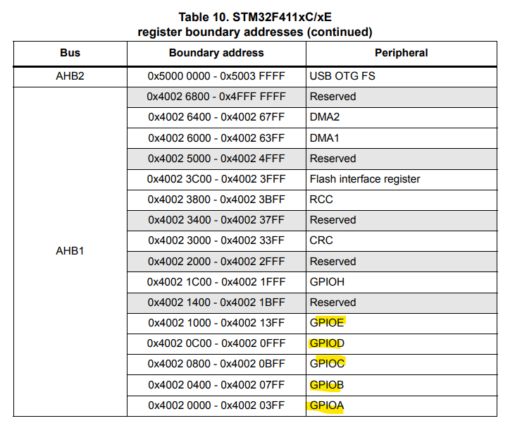

### 숙제
[GPIO 만들기 (GPI+GPO 합치기)]

- GPIO (General Purpose Input/Output)

APB_SlaveInf에 IDR, ODR, MODER 이 있어야 한다.
& inout buffer 만들기 (input과 output을 동시에 사용하기 위해서)

MODER: 0x00
IDR : 0x04
ODR: 0x08

이렇게 register 3개 쓰기!!

c언어 코드: GPIO typdef 만들기

--------

### 해설

입력 핀(IDR로 들어가는 3-state buffer)의 경우 inout wire가 high impedance로 만들어줘야 한다.
(입력일 경우 inout wire가 z 로 나오게 만들어줘야한다.)
출력은 항상 0또는 1이 나와야 하기에 high impedance가 되면 안된다.

IP 기 때문에 따로따로 만드는게 좋다. (GPIO, GPI, GPO) 활용해야한다!
APB 만들어 놨으면 APB 별로 안중요. IP에 집중하자

**상용 mcu 구조 (stm32f411xc)**
- block diagram

- memory map

