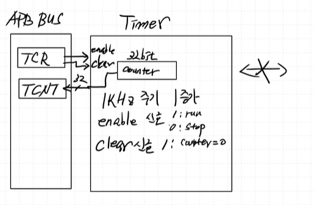
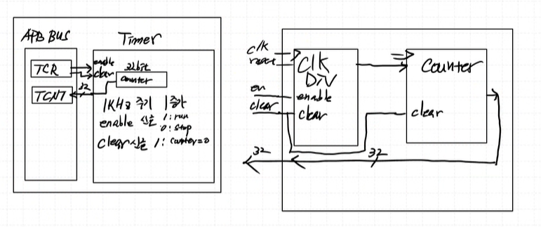
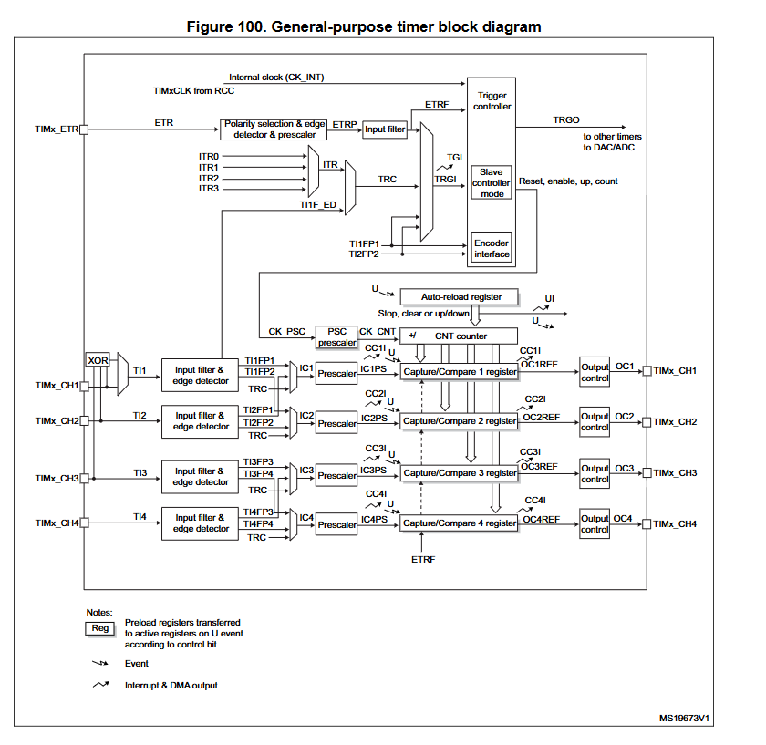
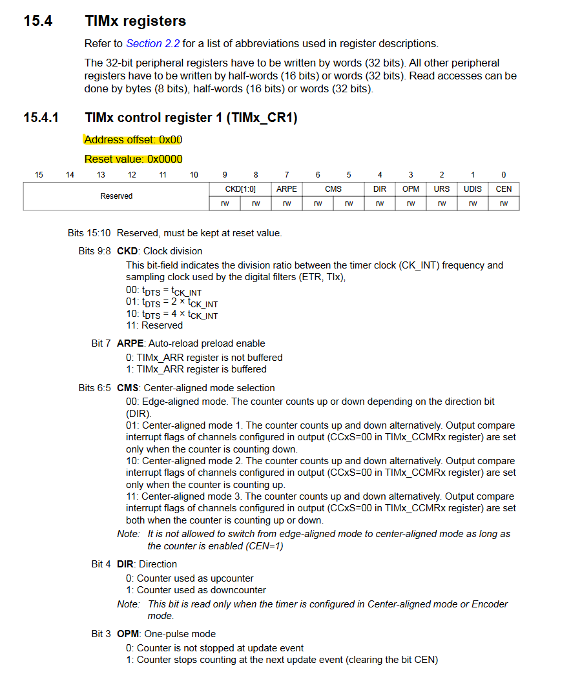

### Timer

32 bit Counter
1ms(주파수 1kHz) 간격으로 counter 1 증가 
enable 신호가 들어오면 카운트 시작(1: run, 0: stop)
0~4,294,967,295(2^32-1)까지 카운트 가능

**APB Bus**
- TCR: Timer Control Register
    - TCR[0] : enable 신호 (1: run, 0: stop)
    - TCR[1] : clear 신호 (1: counter<=0)
- TCNT: Timer Counter Register (counter 값)

**Timer Controlelr**
- CLK Divder (enable, clk, reset, clear)

- Counter (clk, reset, clear)

상용 Timer는 어떻게 돼있을까?

## 문서만드는 tip
[Peripheral 문서 작성법]
- 제목
- 소개
- main 기능
- block diagram

======
- 기능 상세 설명
- Timing Diagram
====== X n

- Reigster Map

> 참고하기 좋은 문서
STM32F103X Cortex-M3
RM0008_Reference Manual 최대한 똑같이 만들기 (따라 만들기기)

---

PSC, APR reg를 추가해보자!

- PSC(pre-scaler) 주파수를 정해주는 역할
