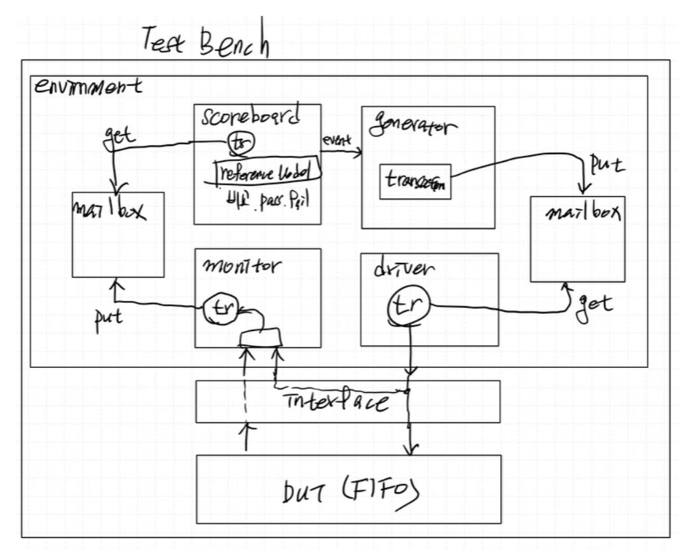
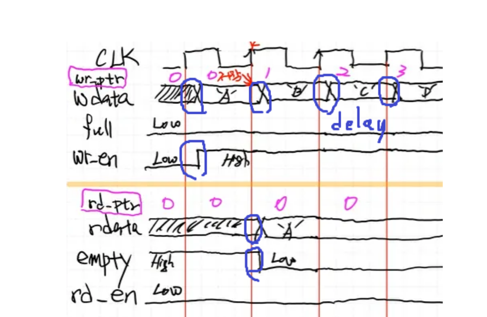
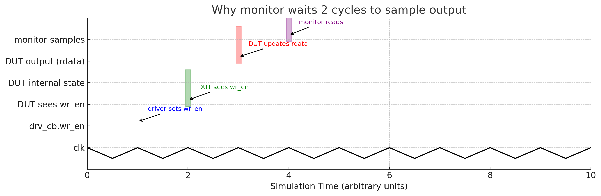
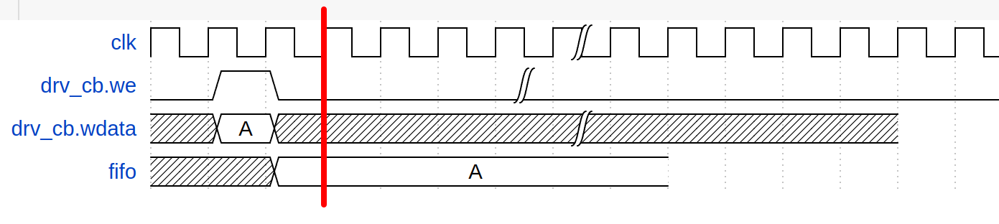

## 1. FIFO 설계

FIFO 는 RAM과 FIFO CU로 구성됨

[Block Diagram]
????????????????????????????????????/

###  (1) RAM
왜 보통 RAM 설계 시 reset 신호를 쓰지 않을까?
> RAM은 보통 내부적으로 수천 개의 저장 셀을 갖고 있어 모든 셀의 reset을 연결하면 회로 복잡도가 급증하기에 reset을 생략하고 초기화를 따로 진행한다.


**4개의 cell을 가지는 RAM 설계**
- addr 2 bit 필요 (0, 1, 2, 3)
- data width는 8bit

### (2) FIFO_CU
FIFO는 기본적으로 선입 선출 queue.

RAM 에 저장된 data를 write or read 하기 위해 
- write, read pointer가 필요 (`wptr`, `rptr`)
- 메모리 공간이 가득 찼는지/ 비었는지 알려주는 control 신호 필요 (`empty`, `full`)

**상태**  
상태는 다음과 같은 3가지 상태가 존재

- Read 만 수행
- Write 만 수행
- Read Write 동시에 수행

각 상태 별로 `wtpr` `rptr` `empty` `full` 을 정의하고 RAM 에 연결한다.

## 2. FIFO systemVerilog simulation


### interface 모듈 구성

clk에 딱 맞춰서 data가 변경된다면 data 값이 변경 전 data인지 변경 후 data인지 애매할 때가 있다. (따라서 보통 표준 timing diagram을 보면 clk에 맞춰서 data를 변경시키지 않고 약간의 delay 후 data가 변경되도록 그린다)

**system verilog 에서 delay를 주는 방법**
clocking block, modport 사용

- modport
DUT에서는 `input`, `output` 방향이 명확하지만,
interface로 묶으면 신호들이 전부 다 `logic`이 되어 방향이 사라지게됨

> modport를 이용하여 `input`, `output`을 구분하여 interface에 접근하는 방향을 명시적으로 구분할 수 있음

- clocking block
특정 clk event에 동기화되며, 입출력 신호에 대해 skew를 정의할 수 있음
(race condition 방지 가능)


**interface에서 괄호 안에 정의한 신호와 밖의 신호들의 차이?**

```systemVerilog
interface fifo_interface (
    input logic clk,
    input logic reset
);
    // write side
    logic [7:0] wdata;
    logic       wr_en;
    logic       full;
```

- 괄호 안에 잇는 신호들은 interface를 인스턴스화할 때 전달받는 외부 입력 (testbench의 initial 값들을 넘겨 받는 것)

- 괄호 밖에 선언들은 interface와 DUT간에 연결되는 I/O 신호들

**다음과 같이 clocking block과 modport를 함께 사용하는 것이 일반적이다**
```systemVerilog
    interface fifo_interface (
        input logic clk,
        input logic reset
    );
    ....
    ....
    //driver용 clocking block
    clocking drv_cb @(posedge clk); 
        default input #1 output #1;
        // write side
        output wdata;
        output wr_en;
        input full;
        // read side
        input rdata;
        output rd_en;
        input empty;
    endclocking

    //monitor용 clocking block
    clocking mon_cb @(posedge clk); 
        default input #1 output #1;
        // write side
        input wdata;
        input wr_en;
        input full;
        // read side
        input rdata;
        input rd_en;
        input empty;
    endclocking

    modport drv_mport(clocking drv_cb, input reset);
    modport mon_mport(clocking mon_cb, input reset);

```
만일 clocking block 만 사용했을 경우 clocking  모듈 안에 정의된 in/output 신호들은 clocking block 안에서만 적용되므로, 다른 class에서 interface를 불러오고 clocking block의 output에 write하는 것이 가능하다.

```systemVerilog
    modport drv_mport(clocking drv_cb, input reset);
```
이런식으로 modport와 함께 사용하면 `clk`을 기준으로 input output에 skew를 줄 수 있고, clocking block에 정의된 signal의 방향이 그 modport의 signal direction(ex) driver, monitor)의 direction이 된다.


**driver 용 clocking block**

```systemVerilog
    interface fifo_interface (
        input logic clk,
        input logic reset
    );
    ....
    ....
    //driver용 clocking block
    clocking drv_cb @(posedge clk); 
        default input #1 output #1;
        // write side
        output wdata;
        output wr_en;
        input full;
        // read side
        input rdata;
        output rd_en;
        input empty;
    endclocking
```
driver 기준에서 driver가 값을 읽느냐 쓰느냐에 따라 signal direction이 정해진다.
```lua
             [driver]                [DUT]
             --------                -----
             wdata   --> ------------->
             wr_en   --> ------------->
             rd_en   --> ------------->
             <-------------  full
             <-------------  rdata
             <-------------  empty

```
### transaction 구성
```systemVerilog
class transaction;
    rand logic operator;
    rand logic we;
    rand logic re;
    rand logic [7:0] wdata;
    logic [7:0] rdata;
    logic empty;
    logic full;
```
fifo 모듈 port중 `clk`, `rst`을 제외한 input signal들은 랜덤으로 생성되도록 한다. 

**operator sig**
기존 fifo 모듈에 없던 `operator` 를 생성하여 
(1) random 값으로 생성된 `operator`값이 1이라면 DUT에서 write 동작을 하도록 driver에서 we 신호를 적절히 제어하여 interface 를 조절하여 DUT로 넘겨주고,
(2) `operator` 값이 0이면 DUT에서 read 동작을 할 수 있도록 driver에서 re 신호를 적절히 제어하여 interface를 조절하여 DUT로 넘겨준다.

**random constraint**
확률적 랜덤 제어를 위해 사용되는 distribution 구문
> `constraint`는 random 변수에 대해 어떤 값만 허용할지 조건을 정해주는 제약 조건 블록이다.

```systemVerilog
var dist { value1 :/ weight1, value2 :/ weight2, ... };
```
- `:/`는 '~ 비율로 주어진다' 는 의미

<details>
<summary> 예시</summary>

```systemVerilog
a dist { 1:/80, 0:/20 };
```
1이 80% 확률, 0이 20%로 확률로 랜덤 생성된다는 의미

</details>

### driver 구성
**write/read task에 `fifo_if.drv_cb` 를 앞뒤로 wait 하는 이유**

```systemVerilog
    task write();
        @(fifo_if.drv_cb);
        fifo_if.drv_cb.wdata <= fifo_tr.wdata;
        fifo_if.drv_cb.wr_en <= 1'b1;
        fifo_if.drv_cb.rd_en <= 1'b0;
        @(fifo_if.drv_cb);
        fifo_if.drv_cb.wr_en <= 1'b0;
    endtask  //
```

(1) 앞에 배치된 trigger 신호는 이전 사이클이 정상적으로 종료되기까지 기다리도록 하는 역할이고,  
(2) 뒤에 배치된 trigger 신호는 한 싸이클 동안 신호를 유지하도록 하기 위함이다.


### Monitor 구성

```systemVerilog
class monitor;
    mailbox #(transaction) Mon2SCB_mbox;
    virtual fifo_interface.mon_mport fifo_intf;
    ....
    ....

    task run();
        transaction fifo_tr;
        forever begin
            @(fifo_intf.mon_cb);
            @(fifo_intf.mon_cb);
            fifo_tr       = new();
            fifo_tr.we    = fifo_intf.mon_cb.we;
            fifo_tr.re    = fifo_intf.mon_cb.re;
            fifo_tr.wdata = fifo_intf.mon_cb.wdata;
            fifo_tr.rdata = fifo_intf.mon_cb.rdata;
            fifo_tr.empty = fifo_intf.mon_cb.empty;
            fifo_tr.full  = fifo_intf.mon_cb.full;
            Mon2SCB_mbox.put(fifo_tr);
            fifo_tr.display("MON");
        end
```

왜 `@(fifo_intf.mon_cb);` 이렇게 2번이나 clk posedge 를 wait할까?





ram이 flip flop 으로 동작하고, input 신호가 skew 되어 들어오기 때문에 최소 2clk 뒤에 신호를 받는 것이 안정적이다.
