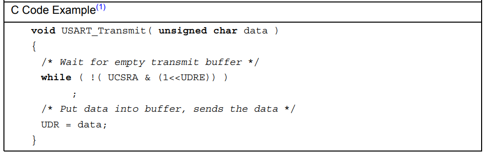

### memory map


---
최종 코드
**testbench**
[uart_tx testbench code](3.uart_fifo/tb_uart_tx_fifo.sv)
[uart_rx testbench code](3.uart_fifo/tb_uart_rx_fifo.sv)

최종 HW 코드
[team 최종 코드](5.merge/)
[개인 최종 코드](4.addapp/)

---
**느낀점 (면접 준비)**
- UART 설계에서 FIFO 출력 문제
```c
    UART_writeData(UART, '[');
    UART_writeData(UART, 'u');
    UART_writeData(UART, 's');
    UART_writeData(UART, ' ');
    UART_writeData(UART, 'a');
    UART_writeData(UART, 'u');
```

위와 같이 연속적으로 wirte operation을 실행할 경우,  
`TXFIFO에 push 되는 속도 < TXFIFO에서 pop되는 속도 ` 이므로,  
pop 되기전에 data를 push 할 수 있다. -> 최악의 경우 full 되어 write data가 누락될 수 있다.  

UART TX 에서 1 byte를 송신하는데 까지 걸리는 시간은 `1/9600 * 10bits = 1.041ms` 이므로 write data 간의 term이 최소한 `1.041ms` 정도는 확보되어야 한다.


```c
    UART_writeData(UART, '['); delay(5);
    UART_writeData(UART, 'u'); delay(5);
    UART_writeData(UART, 's'); delay(5);

    //delay 함수 정의
    void delay(int n) {
        volatile uint32_t temp = 0;
        for (int i = 0; i < n; i++) {
            for (int j = 0; j < 1000; j++) {
                temp++;
                }
            }
    }
```

위 `delay(5)`의 소요시간을 계산해보면 대략 경우 총 반복 횟수 5*1000 회, cycle 당 명령어 소요시간 18 * 4(asssembly code를 통해 확인한 명령 개수 * store 명령어이므로 4 cycle(multi cycle 기준)) * 10ns (100MHz clk) 로 3.6ms 가 소요된다.

`delay(2)`가 위와 같은 방법으로 계산 시 1.4ms 정도 소요되니 `delay(2)` 만 써도 충분하긴 하다.

따라서 위와 같이 delay를 삽입하여 해결하였으나, 사실 이렇게 해결하는건 일반적인 방법 보다는 노가다에 가까운 듯 하고.. 실제로는 아래와 같이 해결한다고 한다.

```c
void UART_writeData (UART_TypeDef *UARTx, uint32_t data) {
    while((UART_state(UARTx) && (1 << 1))); //full일 경우 loop에 갇혀있음
    UARTx -> TDR = data;
}
```

예시로 Atmega32A document에 보면, write (transmit) 동작에 대한 예시 함수를 볼 수 있다.



확인해보면 transmit buffer가 empty 일때까지 기다린 후 data를 put하는 것을 볼 수있는데, 이는 해당 MCU에서는 buffer의 size가 1 size 밖에 되지않아 이런 것으로 생각된다.

시간이 더 주어진다면 위와 같이 delay 함수를 통해 데이터 누락 현상을 해결한다기보다 위와 같이 소프트웨어 적으로 조금 더 최적화하여 간단하게 누락 현상을 해결할 수 있지 않을까 싶다.

read의 경우는,
```c
uint32_t UART_readData(UART_TypeDef *UARTx) {
    while((UART_state(UARTx) && (1 <<0))); //empty일 경우 loop에 갇혀있음
    return UARTx->URD;
}
```