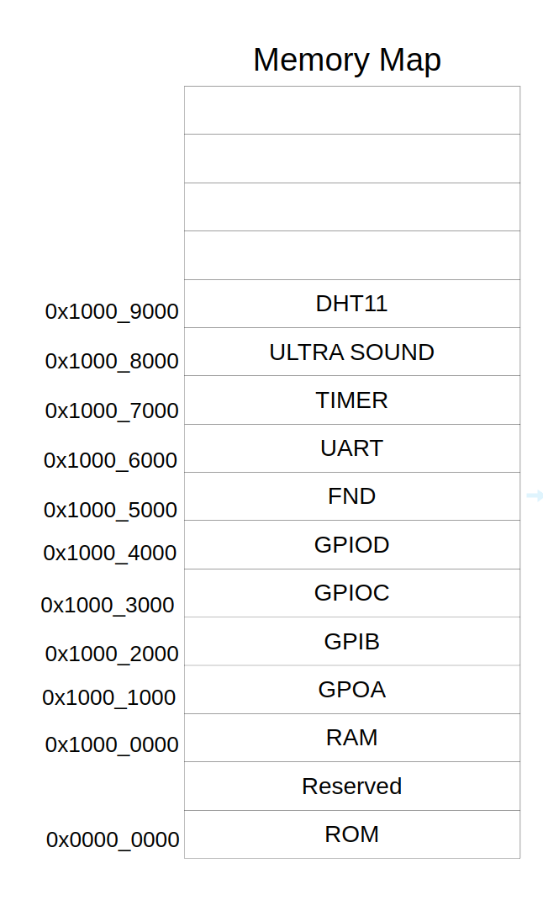

### memory map

---
최종 코드
**testbench**
[uart_tx testbench code](3.uart_fifo/tb_uart_tx_fifo.sv)
[uart_rx testbench code](3.uart_fifo/tb_uart_rx_fifo.sv)

최종 HW 코드
[team 최종 코드](5.merge/)
[개인 최종 코드](4.addapp/)
