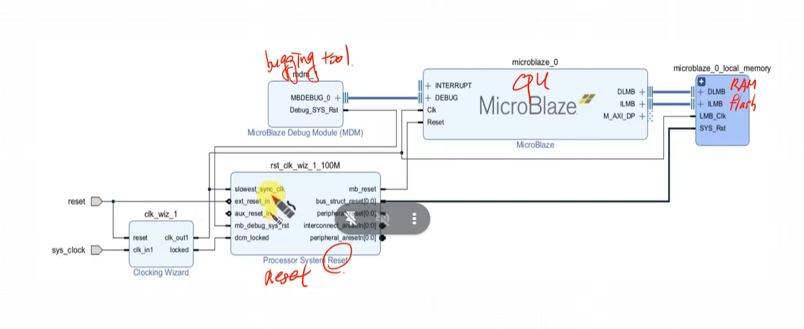
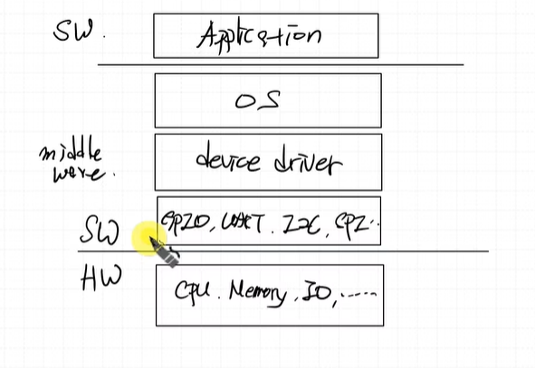
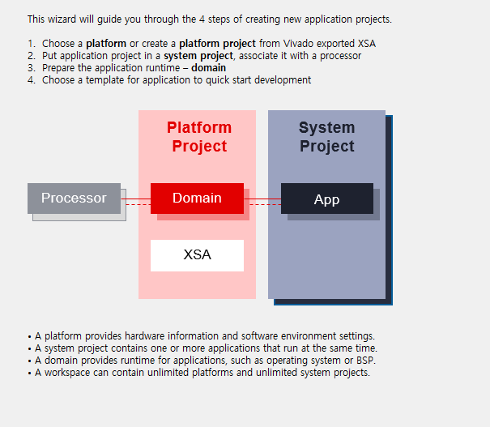
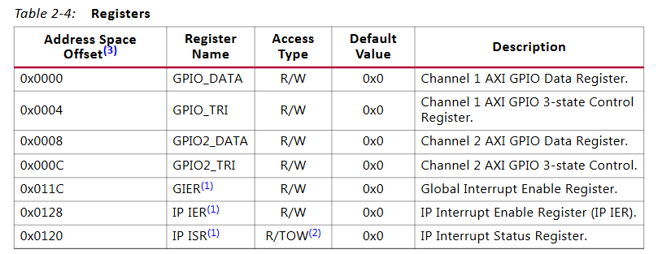
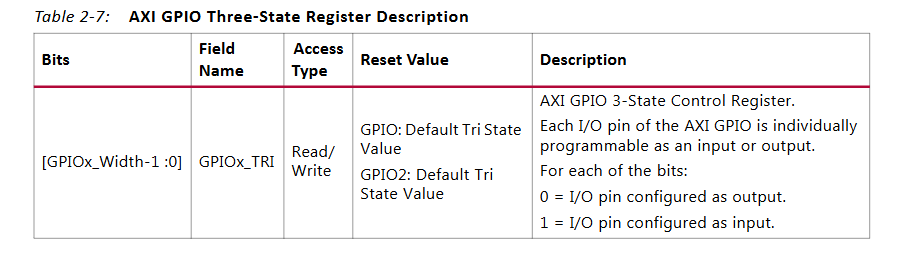
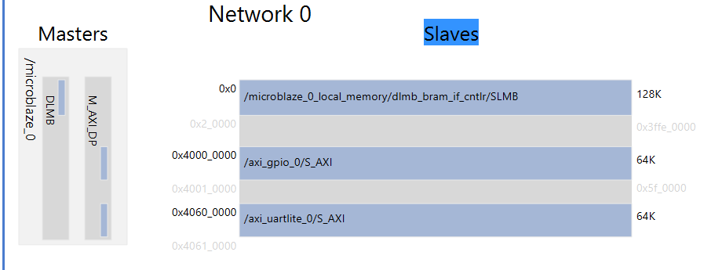
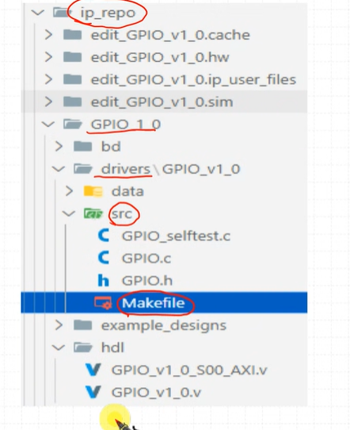
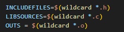

microblaze 환경 설명

rst block -> 장치 마다의 reset timing 이 다르다. 이를 관리

APB -> peripheral 연동 -> APB bridge를 이용해 AXI에 붙이기 가능


[플랫폼] -> 하드웨어 에서는?
지금하고 있는게 플랫폼 환경을 만드는 거라 함

**컴퓨터 구조**

middle ware를 활용하는 sw -> application (ex) 게임, office 툴)

플랫폼: application을 돌리기 위한 환경을 말한다.



vitis에서 gpio에 low level로 접근하고 싶다.
`axi gpio datasheet`

우리가 해야할 일 -> register에 접근하여 control
register 정보만 알면된다.
`GPIO_TRI` gpio 3-state control register : input output 관리
`GPIO_DATA` gpio data reg

우리는 gpio 1만 쓰는중, 따라서 `0x0000` 과 `0x0004` offset 의 register 만 관리

- GPIO mode 설정
    
    - 0 : output mode
    - 1 : input mode

- 현재 gpio mem map


vitis code
```c

```

xilinx bug 잡기 (make file 오류 고치기)


wildcard 안붙이면 컴파일할때 에러난다.
