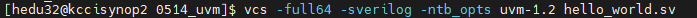
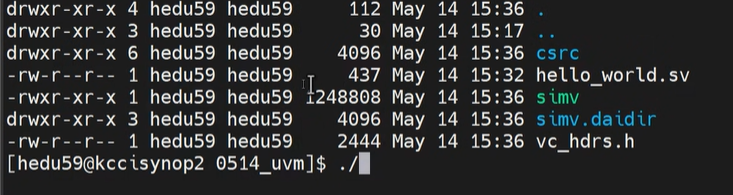
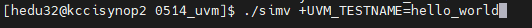
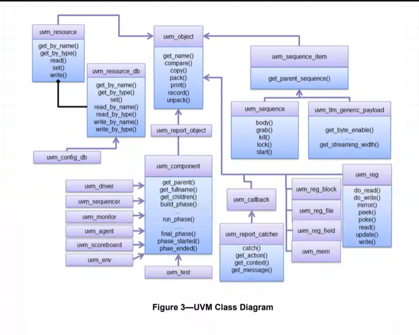
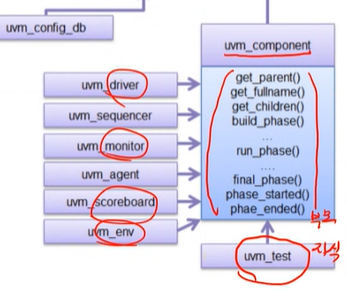
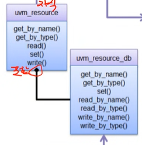
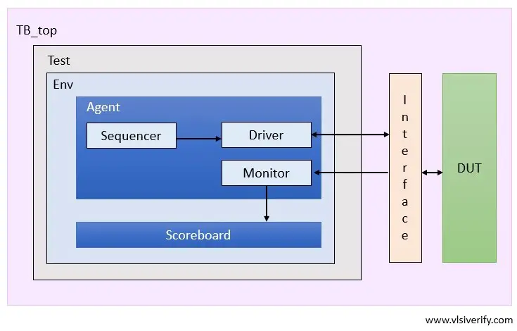

microblaze 환경 설명

rst block -> 장치 마다의 reset timing 이 다르다. 이를 관리

APB -> peripheral 연동 -> APB bridge를 이용해 AXI에 붙이기 가능


[플랫폼] -> 하드웨어 에서는?
지금하고 있는게 플랫폼 환경을 만드는 거라 함

**컴퓨터 구조**

middle ware를 활용하는 sw -> application (ex) 게임, office 툴)

플랫폼: application을 돌리기 위한 환경을 말한다.


vitis에서 gpio에 low level로 접근하고 싶다.
`axi gpio datasheet`

우리가 해야할 일 -> register에 접근하여 control
register 정보만 알면된다.
`GPIO_TRI` gpio 3-state control register : input output 관리
`GPIO_DATA` gpio data reg

우리는 gpio 1만 쓰는중, 따라서 `0x0000` 과 `0x0004` offset 의 register 만 관리

- GPIO mode 설정
    
    - 0 : output mode
    - 1 : input mode

- 현재 gpio mem map


xilinx bug 잡기 (make file 오류 고치기)


wildcard 안붙이면 컴파일할때 에러난다.


---
### vcs 이용하기
vcs -> compiler
> vcs는 system verilog를 compile할 수 있는 synopsys에서 제공하는 compiler이다.
> vivado를 이용해서도 uvm을 돌릴 수 있지만 vcs tool을 사용해봤다는거에 메리트가 있다고 한다.

complie 방법
 -> 이러면 결과물인 `simv` 가 나온다.


d: directory


실행 방법



```systemVerilog
program automatic test;
        import uvm_pkg::*; //uvm pkg 땡겨온다.

        class hello_world extends uvm_test;
                `uvm_component_utils(hello_world)

                function new(string name, uvm_component parent);
                        super.new(name, parent);
                endfunction


                virtual task run_phase(uvm_phase phase);
                        phase.raise_objection(this);
                        `uvm_info("TEST", "hello world!", UVM_MEDIUM);
                        phase.drop_objection(this);
                endtask
        endclass

        initial begin
                run_test();
        end
endprogram

```
<details>
<summary> 설명 </summary>

```systemVerilog
program 
// > test용 SW 묶음, block
```

```systemVerilog
import uvm_pkg::*;
```
> Accellera에서 제공하는 uvm 클래스 모든 라이브러리 다 갖다쓴다는 것을 의미

`Accellera`에서 제공하는 UVM 클래스 라이브러리 전체 패키지 적용
`Accellera`: UVM을 만들고 배포하는 단체

```systemVerilog
class hello_world extends uvm_test;
...
endclass
```
`extends`: 부모 class(`uvm_test`) 를 상속 받겠다는 의미.
framework에 있는 것을 그대로 갖다 쓰기 때문에 상속 받아야 한다.
`uvm_test` : uvm의 최상위 시나리오(test)용 base class, initial에 쓰인 `run_test()`도 얘가 포함한거
-> `uvm_test`는 top level test class 임. 
-> `uvm_test`는 `run_test()`를 실행할 때 factory가 가장 먼저 실행되는 객체임

```systemVerilog
`uvm_component_utils(hello_world)
```
-> factory에 class를 등록하는 매크로


```systemVerilog
function new(string name, uvm_component parent);
        super.new(name, parent);
endfunction
```
-> 클래스 인스턴스를 만들기 위한 생성자.
-> `super` : 부모 클래스를 의미, 여기서는 `uvm_test`임.
-> 해당 코드로 인해 class `hello_world`가 생성되면 부모 클래스 `uvm_test`도 함께 생성이된다.


```systemVerilog
virtual task run_phase(uvm_phase phase);
        phase.raise_objection(this);
        `uvm_info("TEST", "hello world!", UVM_MEDIUM);
        phase.drop_objection(this);
endtask
```

실제 동작 시뮬레이션 구간 phase, fork run 이랑 비슷하다고 생각하기
**objection 메커니즘**
`phase.raise_objection(this)` : helloworld의 해당 instance "할 일 있어요! 시뮬레이션 끝내지 마세요!"
`phase.drop_objection(this)` : 이제 끝남

`uvm_info("TEST", "hello world!", UVM_MEDIUM);` : 
- "TEST" -> ID : display 할 때 "MON", "SCB", "GEN" 같은거
- "hello_world" -> String: string msg 
- UVM_MEDIUM -> verbosity: 디버깅 시 로그 얼마나 자세히 출력할건지, medium은 중간
</details>

### UVM user guide


화살표를 받는 쪽이 부모, 보내는 쪽이 자식 class



이런 이상한 화살표는 instance를 내부에 포함하는 경우라고 한다.



### UVM Structure

가장 simple한 uvm architecutre

