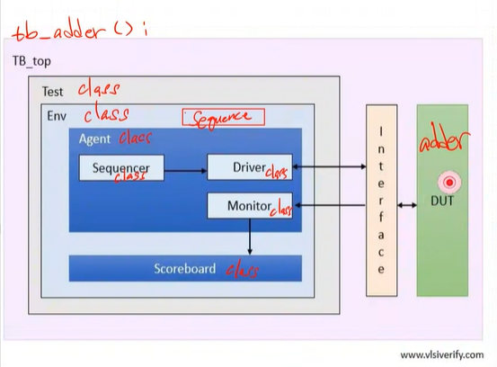
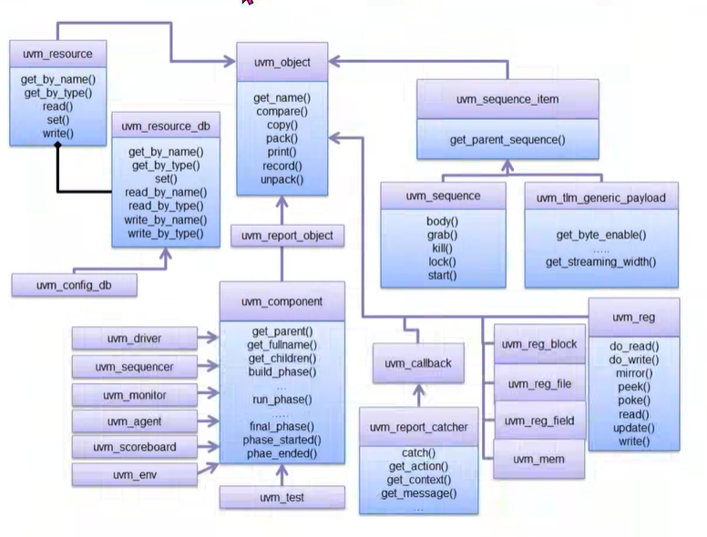
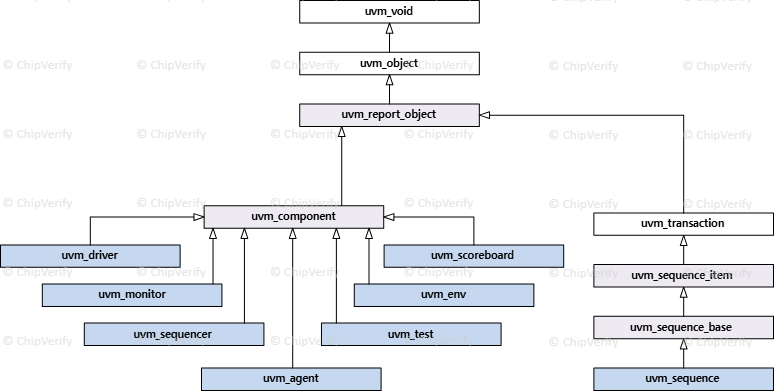
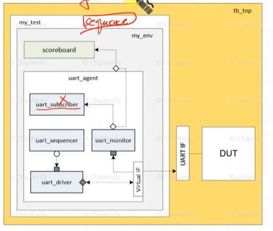
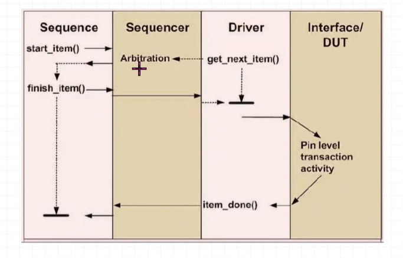
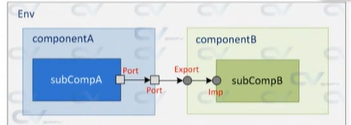
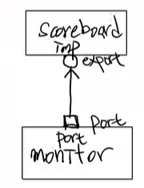
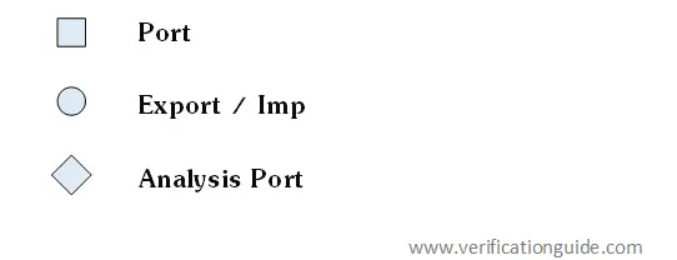
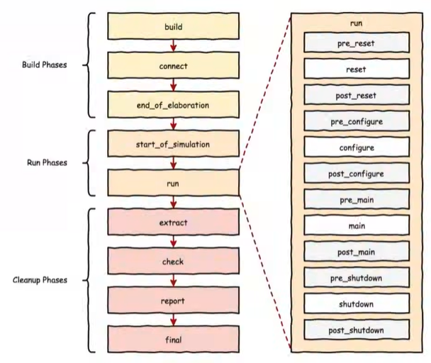

[framework]
uvm framework를 왜 쓰는가?
경험 많은 사람들이 반도체 검증에 가장 효율적인 형태라고 생각해온 형태로 되어있음

verdi -> synopsys tool
코드 한줄 한줄에 대한 timing diagram 확인 가능

"vcs, verdi" tool 사용 경험 좋다!!






uvm_component를 uvm_test가 상속받고, 이를 또 우리가 만든 test class가 상속받는다.

```systemVerilog
class test extends uvm_test;
```
화살표 방향이 부모 class
부모 class의 기능을 자식 class가 상속받는다.

    상속하면 기능 확장이 된다.


**uvm_component 부모 class의 method overiding**
    overiding : 부모 클래스와 똑같은 이름을 가진 함수 이름을 쓴다.
    
이때 자식클래스에 있는 함수가 동작한다.
부모클래스에 함수 이름만 존재하는 경우가 많고, 보통 자식 클래스에서 상속받아 함수를 구현한다.

```systemVerilog
virtual function void build_phase(uvm_phase phase); 
    super.build_phase(phase);
    adder_seq = adder_sequence :: type_id :: create("SEQ", this); 
    //"factory excute: factory에서 실행했다"(adder_seq = new(); 한거랑 비슷)
    adder_env = adder_envirnment :: type_id :: create("ENV", this);
endfunction

virtual task run_phase(uvm_phase phase); //overiding
//test class 안에 있는 모든 것들을 실행시키는 task
    phase.raise_objection(phase);
    adder_seq.start(adder_env.adder_agt.adder_sqr); //sequence와 sequencer는 다르다
    phase.drop_objection(phase); //objection 해제, run_phase 종료
endtask
```

build_phase()와 run_phase는 부모 class에 정의된 method. 이를 자식 class에서 구현


### Factory registration
`uvm component` 와 `uvm object` class 사용하려면 "factory registeration"이 선행되어야한다.

```systemVerilog
class adder_envirnment extends uvm_env;
    `uvm_component_utils(adder_envirnment)

```


### vcs compile 실행
    [hedu32@kccisynop2 0515_uvm_adder]$ vcs -full64 -sverilog -ntb_opts uvm-1.2 ./rtl/adder.v ./tb/tb_adder.sv


# UVM 구조 알아보기
## UVM class hierarchy

- Agent : sequencer -> driver -> monitor
- env : scoreboard, Agent
- test : env

factory> 공장이 돌기위한 공간이 있고, 공간에 맞게끔 내가 새롭게 끼워맞추는 느낌임
상속받은 다음에 factory에 등록해야함

> "factory"는 객체지향에서 쓰이는 용어이다.

<details>
<summary>팩토리 패턴이란?</summary>

개념 : 객체를 생성하는 인터페이스를 제공하여 객체의 생성 과정을 캡슐화하는 방법
즉, 팩토리 메소드 패턴에서는 객체를 생성하기 위한 인터페이스를 정의하는데, 어떤 클래스의 인스턴스를 만들지는 서브 클래스에서 결정하게 만드는 패턴이다.

</details>


## test 구조

sequence에서 item을 random generate한 다음 sequencer로 보낸다.
    sequence(generate random item) -> sequencer -> driver -> IF

    IF -> monitor -> scoreboard 


## test process

### sequence , sequencer , driver, interface/dut

    sequencer에서 driver로 전송될 때까지 sequence는 item을 생성하지 않는다.

1. sequence에서 `start_item()`을 실행시킴 -> sequence에서 sequencer로 item을 보낸다.
    <details>
    <summary> 예시 </summary>

    ```systemVerilog
    for (int i = 0; i < 10; i++) begin
                start_item(adder_item);
    ```

    </details>

2. sequencer에서 item을 등록한다.
    `sequencer`는 중재자(aribiter) 역할을 한다.

3. Driver에서 `get_next_item()`
driver가 mailbox transaction 기다리고 있다가 get 하는것과 비슷
item이 들어올 때 까지 block(대기) 하고 있는다.
& sequencer에 알린다.

```systemVerilog
class adder_driver extends uvm_driver #(adder_seq_item);
    `uvm_component_utils(adder_driver)
    forever begin
        seq_item_port.get_next_item(adder_item);
```

4. sequence 

```systemVerilog
class adder_sequence extends uvm_sequence #(adder_seq_item);
    `uvm_object_utils(adder_sequence)

    virtual task body();
        for (int i = 0; i < 10; i++) begin
            start_item(adder_item);
            adder_item.randomize();
            finish_item(adder_item);
        end
```

sequence에서 item randomize하고 item만드는걸 finish 한다.
=> 여기서 `item_done()` 될때까지 block 걸림

5. driver가 `get_next_item()` 받으면 interface로 item 떤진다.

```systemVerilog
class adder_driver extends uvm_driver #(adder_seq_item);
    `uvm_component_utils(adder_driver)
    seq_item_port.get_next_item(adder_item);
    @(posedge a_if.clk);
    a_if.a = adder_item.a;
    a_if.b = adder_item.b;
```
item 떤지고나서 driver에서 `item_done()`을 한다.

```systemVerilog
class adder_driver extends uvm_driver #(adder_seq_item);
    seq_item_port.item_done();
```
6. driver 가 item_done()을 하면 sequence에서 다시 `start_item`을 돌린다.

### scoreboard <-> monitor

네모는 port, 동그라미는 export



monitor에서 scoreboard 의 write 함수를 부르고 item을 전송, 
scoreboard에서 받은 item을 통해 write 함수 동작시켜서 판단.

```systemVerilog
class adder_monitor extends uvm_monitor;
    `uvm_component_utils(adder_monitor)  //factory 등록
    uvm_analysis_port #(adder_seq_item) send;
    virtual task run_phase(uvm_phase phase);
        forever begin
            ...
            ...
            send.write(adder_item);  //scoreboard로 전송
        end
    end
endclass

class adder_scoreboard extends uvm_scoreboard;
    `uvm_component_utils(adder_scoreboard)

    uvm_analysis_imp #(adder_seq_item, adder_scoreboard) recv;  //
    
    
    virtual function void write(
        adder_seq_item item
    );  //monitor -> scb로 transaction을 보낼 때 사용하는 함수
        adder_item = item;
        ...
        ...

        if (adder_item.y == adder_item.a + adder_item.b)
            `uvm_info("SCO", "*** TEST PASSED ***", UVM_NONE)
        else `uvm_error("SCO", "*** TEST FAILED ***");
    endfunction
...


```


> scoreboard에 있는 item이 아닌데 어떻게 monitor에 item을 전달받음?

```systemVerilog
class adder_envirnment extends uvm_env;
    `uvm_component_utils(adder_envirnment)
    adder_agt.adder_mon.send.connect(adder_sco.recv);  //TLM port 연결
```
envirnment에 이렇게 기술되어 있어서 monitor에 있는 send port와 scoreboard에 있는 recv export를 연결시켜줌

***monitor의 send***
```systemVerilog
class adder_monitor extends uvm_monitor;
    uvm_analysis_port #(adder_seq_item) send;

    function new(string name = "MON", uvm_component parent);
        super.new(name, parent);
        send = new("WRITE", this);
    endfunction

```
monitor의 send는 처음 instance화 될때 send mem 변수 (send port) 가 이렇게 정의된다.

***scoreboard의 recv***
```systemVerilog
class adder_scoreboard extends uvm_scoreboard;
    `uvm_component_utils(adder_scoreboard)

    uvm_analysis_imp #(adder_seq_item, adder_scoreboard) recv;  //

    adder_seq_item adder_item; //"adder_seq_item"은 class 이름, "adder_item"은 handler


    function new(string name = "SCO", uvm_component parent);
        super.new(name, parent);
        recv = new("READ", this);
    endfunction
```
scoreboard의 recv는 처음 instance화 될 때 recv mem 변수 (recv export) 가 정의된다.

"TLM port"

### TLM 이란?
- TLM 종류


item은 TLM 을 통해 전송된다. TLM은 component간 데이터를 transaction 할 때 쓰임

### phase



uvm이 실행되면 각 component(test, env, agent 등)들의 phase들이 순차적으로 실행된다.

    모든 각 component들의 build phase가 모두 실행된 후 -> 다음 phase인 connect phase가 실행 -> ...

여기서 `run phase`는 모두 동시 실행된다. (fork join_any 같은거임)


----

### 수정사항
**test class 주석처리**

```systemVerilog
module tb_adder ();
    //test adder_test;  //handler
    adder_if a_if ();

    always #5 a_if.clk = ~a_if.clk;

    initial begin
        a_if.clk   = 0;
        //adder_test = new("TEST", null);
        uvm_config_db#(virtual adder_if)::set(null, "*", "a_if", a_if);
        //uvm_config_db library : database에 interface 정보를 저장할 수 있다.
        run_test();  //test 안에 있는 program들이 실행 된다.
    end
```
-> test class 주석 처리했는데 어떻게 instance?
console에서 아래처럼 하면 자동으로 test instance
    ./simv +UVM_TESTNAME=test -l simv.log


**topology 확인 위해 build 와 run 사이에 새로운 phase 추가**
```systemVerilog
virtual function void start_of_simulation_phase(uvm_phase phase);
    super.start_of_simulation_phase(phase);
    uvm_root::get().print_topology();
endfunction
```

결과로 아래와 같은 topology가 출력
    --------------------------------------------------------------
    Name                       Type                    Size  Value
    --------------------------------------------------------------
    uvm_test_top               test                    -     @341 
        ENV                      adder_envirnment        -     @360 
            AGT                    adder_agent             -     @388 
                DRV                  adder_driver            -     @417 
                    rsp_port           uvm_analysis_port       -     @436 
                    seq_item_port      uvm_seq_item_pull_port  -     @426 
                MON                  adder_monitor           -     @398 
                    WRITE              uvm_analysis_port       -     @407 
                SQR                  uvm_sequencer           -     @446 
                    rsp_export         uvm_analysis_export     -     @455 
                    seq_item_export    uvm_seq_item_pull_imp   -     @573 
                    arbitration_queue  array                   0     -    
                    lock_queue         array                   0     -    
                    num_last_reqs      integral                32    'd1  
                    num_last_rsps      integral                32    'd1  
            SCO                    adder_scoreboard        -     @369 
                READ                 uvm_analysis_imp        -     @378 
    --------------------------------------------------------------


**scoreboard에서 왜 20개?**
-> scoreboard에서 info를 2번출력중임
    ** Report counts by severity
    UVM_INFO :   54
    UVM_WARNING :    0
    UVM_ERROR :    0
    UVM_FATAL :    0
    ** Report counts by id
    [DRV]    10
    [MON]    10
    [RNTST]     1
    [SCO]    20
    [SEQ]    10
    [TEST_DONE]     1
    [UVM/RELNOTES]     1
    [UVMTOP]     1


**Makefile 만들기**


Makefile 실행
    make vcs
    make simv

**Makefile 쓰는 이유**
변경된 부분만 compile해줘서 compile에 소요되는 시간을 줄여준다.ㄴ

**Makefile 재사용성 높이기위해 파일 경로 변수화**
    #재사용성을 높이기 위해 아래와 같이 경로 변수화
    #경로는 현재 makefile 기준
    RTL_DIR = ./rtl
    TB_DIR = ./tb
    BUILD = ./build
    DUT = $(RTL_DIR)/adder.v
    TEST_BENCH = $(TB_DIR)/tb_adder.sv
    LOG = simv.log


- `-` 붙이면 에러 나면 다음줄로 넘어간다.
    -mkdir build

- `PHONY`
파일과 명령어가 이름이 똑같을 경우 makefile에 선언되어 있는 이름의 file만 우선으로 동작시켜라


simulation GUI "verdi" 활용
