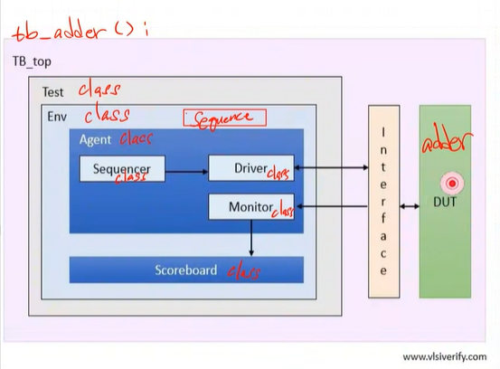
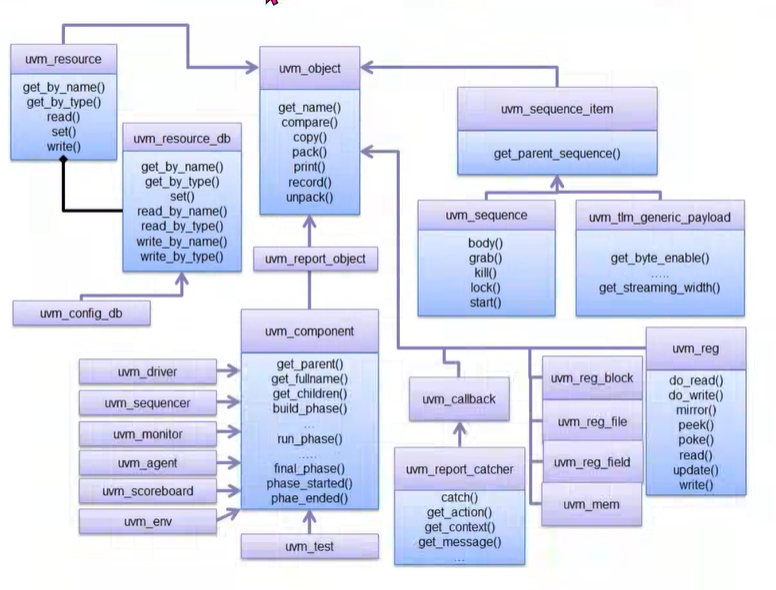

[framework]
uvm framework를 왜 쓰는가?
경험 많은 사람들이 반도체 검증에 가장 효율적인 형태라고 생각해온 형태로 되어있음

verdi -> synopsys tool
코드 한줄 한줄에 대한 timing diagram 확인 가능

"vcs, verdi" tool 사용 경험 좋다!!






uvm_component를 uvm_test가 상속받고, 이를 또 우리가 만든 test class가 상속받는다.

```systemVerilog
class test extends uvm_test;
```
화살표 방향이 부모 class
부모 class의 기능을 자식 class가 상속받는다.

    상속하면 기능 확장이 된다.


**uvm_component 부모 class의 method overiding**
    overiding : 부모 클래스와 똑같은 이름을 가진 함수 이름을 쓴다.
    
이때 자식클래스에 있는 함수가 동작한다.
부모클래스에 함수 이름만 존재하는 경우가 많고, 보통 자식 클래스에서 상속받아 함수를 구현한다.

```systemVerilog
virtual function void build_phase(uvm_phase phase); 
    super.build_phase(phase);
    adder_seq = adder_sequence :: type_id :: create("SEQ", this); 
    //"factory excute: factory에서 실행했다"(adder_seq = new(); 한거랑 비슷)
    adder_env = adder_envirnment :: type_id :: create("ENV", this);
endfunction

virtual task run_phase(uvm_phase phase); //overiding
//test class 안에 있는 모든 것들을 실행시키는 task
    phase.raise_objection(phase);
    adder_seq.start(adder_env.adder_agt.adder_sqr); //sequence와 sequencer는 다르다
    phase.drop_objection(phase); //objection 해제, run_phase 종료
endtask
```

build_phase()와 run_phase는 부모 class에 정의된 method. 이를 자식 class에서 구현


### Factory registration
`uvm component` 와 `uvm object` class 사용하려면 "factory registeration"이 선행되어야한다.

```systemVerilog
class adder_envirnment extends uvm_env;
    `uvm_component_utils(adder_envirnment)

```


    [hedu32@kccisynop2 0515_uvm_adder]$ vcs -full64 -sverilog -ntb_opts uvm-1.2 ./rtl/adder.v ./tb/tb_adder.sv


