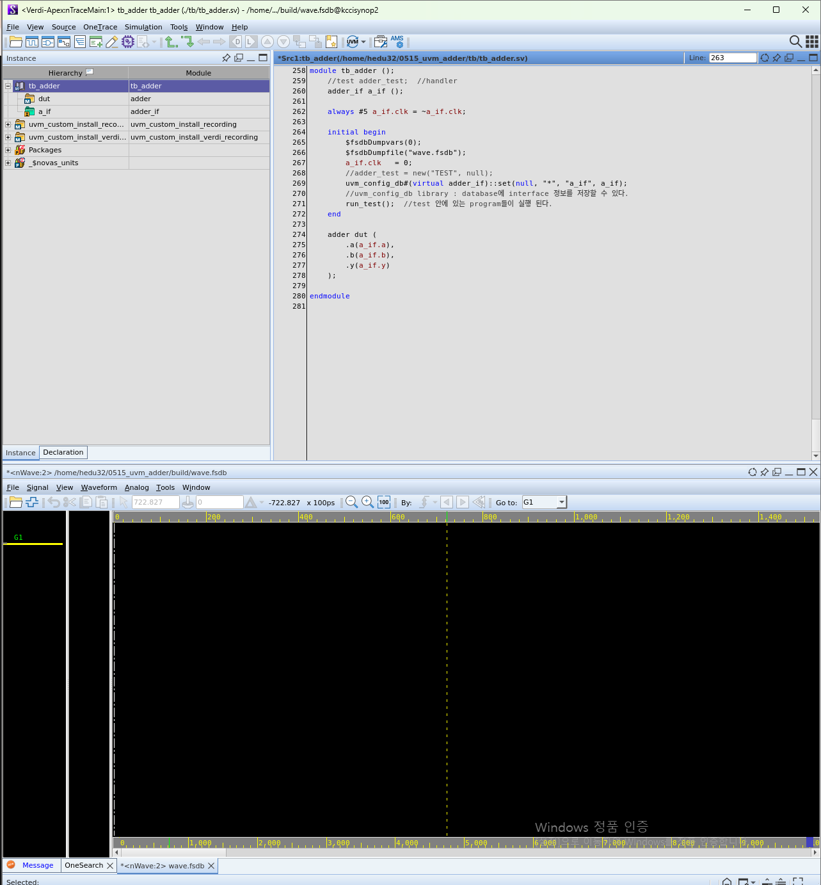
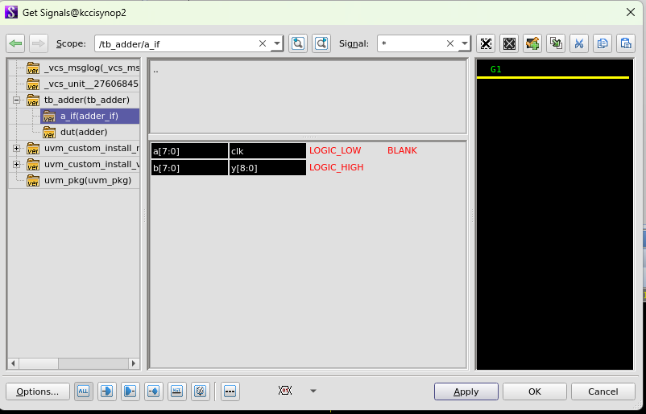
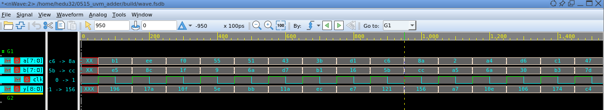

### 파일

- [uvm 기반 adder 검증 testbench code](./tb_adder.sv)

---
## Synopsys Verdi
### verdi 띄우기 위한 사전 작업

> synopsys verdi tool 사용위해 testbench의 모든 정보를 수집, 저장한다.

```systemVerilog
$fsdbDumpvars(0); //"0": 모든 정보를 수집하여 
$fsdbDumpfile("wave.fsdb"); //"wave.fsdb"에 저장하겠다
```
vivado에서도 이런 작업이 필요하나 tool이 다 해줘서 간단해 보이는 것

> verdi 활용 위한 option 추가
**makefile 수정**
- 파일 경로
```Makefile
COMP_OPT = -full64 -sverilog -ntb_opts uvm-1.2 \
		-debug_access+all -kdb \    ## *******이 부분 추가 됨********* 
		-timescale = 1ns/100ps \    ## *******이 부분 추가 됨*********
        -Mdir = $(BUILD_DIR)/csrc \ ## *******이 부분 추가 됨*********
		-o $(BUILD_DIR)/simv \
		-l $(BUILD_DIR)/comp.log
        
FSDB_FILE = $(BUILD_DIR)/wave.fsdb ## *******이 부분 추가 됨*********

SIMV_OPT = +UVM_TESTNAME=$(TEST_NAME) \
		-l ./$(BUILD_DIR)/simv.log \
		+fsdbfile+$(FSDB_FILE)      ## *******이 부분 추가 됨********* 
```
- vcs랑 simv 동시에 돌리기
```Makefile
all: vcs simv
.PHONY: vcs simv clear all
```
- verdi 실행
```Makefile
verdi:
	verdi -dbdir $(BUILD_DIR)/simv.daidir -ssf $(FSDB_FILE)
```


- verdi 실행 시 나오는 이미지  


- waveform 보기  

**waveform 보기 위한 설정**



**waveform 결과**

