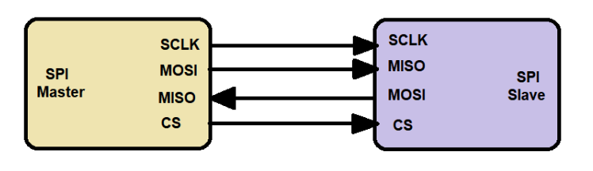
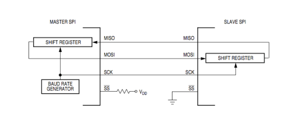
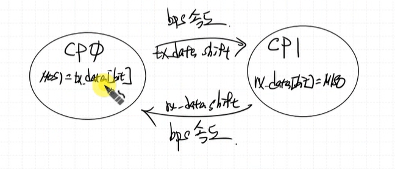
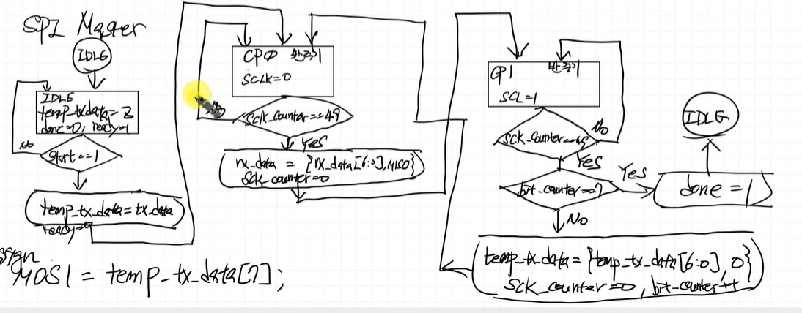
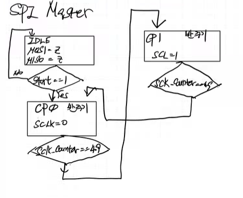

## SPI (Serial Peripheral Interface)

동기식 serial 통신 방식 중 한가지
(serial 통신은 rx-tx 구조를 갖는다.)
1대 다수의 통신을 지원한다. (다수의 통신을 위해서 다수만큼 선이 필요하다는 단점이 있음)
동시에 송수신이 가능하며 I2C에 비해 속도가 빠르다.

> device와 device 간 연결 시 wire가 적게 들어 싸다.

> spi와 i2c 많이 쓰는 이유
  uart는 1:1 통신, 확장성이 별로 좋지 않다.
  spi, i2c는 1:다수 통신이 가능하여 확장성이 좋다.

### UART vs SPI vs I2C
| Feature | UART | SPI | I2C |
|---------|------|-----|-----|
| Type    | Asynchronous | Synchronous | Synchronous |
| 전송방식 | 1:1 | 1:다수 | 1:다수 |
| line 수 | tx, rx | MOSI, MISO, SCLK, CS | SCL, SDA(주소, data) |
| 이중통신 | full-duplex | full-duplex | half-duplex |
| (상대적인)속도 | 느리다(spi보다) | 빠르다(uart, i2c 보다) | 느리다(spi 보다) |
| (상대적인)구현난이도 | simple | simple | complex |

- I2C는 선 하나(`SDA`)로 주소와 data를 모두 받는다, data를 보낼 떄 주소를 붙여서 보낸다. 
    -> 구조 자체가 SPI 에 비해 빠를 수가 없음
    - but 현장에서는 I2C를 더 많이 쓴다. 
        - 선 가닥이 2개 밖에 없기 때문 
        - SPI는 slave가 늘어날 경우 CS를 늘려야 하는데 I2C는 이 경우 편리(선 두가닥만 연결하면 됨)
        - 이미 만들어진 통신 모듈을 갖다 쓰는 사람 입장에서는 I2C가 가장 편리 but 구현은 I2C가 상대적으로 가장 복잡

- SPI Line 수 의 경우 master 입장에서 봤을 때 Slave가 늘어남에 따라 CS가 늘어날 수 있다.
- UART는 속도를 높일 경우 error율이 높아지기 때문에 속도를 높이는데 한계가 존재
- 속도가 빠른게 필요할 때 : SPI, 속도 ㄱㅊ, simple한게 필요 : I2C

### 신호선 구성 (4개)

- SCLK (CLK)  
- MOSI (Master Out Slave In)  
- MISO (Master In Slave Out)  
- CS (Chip Select, ***Active LOW***)  

### 특징
- synchronous 통신 방식 (master가 clk 생성)  
- Master <-> Slave 구조  
- 고속 통신 지원 (UART, I2C 에 비해 속도가 빠르다.)  
- 다중 장치 지원  
    - 하나의 Master가 여러 Slave와 통신 가능 (BUS)  
    - data broadcasting, chip select 
- SPI 장치들은 shift register를 가지고 있으며, 기본적으로 MSB 부터 전송된다. 밀어내기 식으로 data가 input 된다.
 

### 1 master multi slave 구조  

### data 전달

Master -> Slave 로 MSB 부터 전달  
-> Slave는 받은 bit를 shift 시켜야함 (MSB 부터 받았으니까)  

Master가 Slave에 `MOSI`로 7번째 bit 보낼 때 Slave에서도 7번째 bit를 `MISO`를 통해 보낸다.  

따라서 read할 때 Master 에서 Slave로 dummy data를 전송해야함 (master가 보내야 slave data가 나온다, 두 선이 동기화 되어 있음)  

### timing diagram

MISO는 slave에서 계속 들어오고 있음, but Master에서 sampling을 가운데서 수행

### CPOL과 CPHA
**CPOL(Clock Polarity)**  
`CPOL`이 0이면 clk 시작이 low, 1이면 clk 시작이 high  

**CPHA(Clock Phase)**  
`CPHA`이 1이면 sample 위치가 clk 1번째 edge 에서 sampling  
0이면 clk 2번째 edge 에서 sampling  

`CPOL`의 값에 따라서 rising edge인지 falling edge 인지 달라진다.  

## 가장 먼저 `CPOL`이 0, `CPHA`이 0인 경우를 구현해보자.

CPOL, CPHA가 0인 경우는 data가 clk negedge에서 나가는 경우.
clk 하강 에지를 본 후 data가 변화 -> delay 존재. 에지에서 바로 나가지 않는다.

### schematic

### data 전송

MOSI는 data를 clk negedge에 송신
MISO는 data를 clk rising edge에 수신

### FSM

### ASM

- SCLK 생성하기
SCLK 생성 logic

bps는 1MHz
100MHz의 system CLK을 받아 1MHz의 SCLK 을 생성하자

- MISO
data를 가운데서 sampling 하는게 error 율이 작을 것

- MOSI
low edge에서 다음 비트 전송

CPOL이 1일 때 기다려줘야 하는게 좀 까다롭다 함

    Master에서는 negedge에서 MOSI 보냄, rising edge에서 MISO 받음
    Slave 에서는 negedge에서 MISO 보냄, rising edge에서 MOSI 받음

