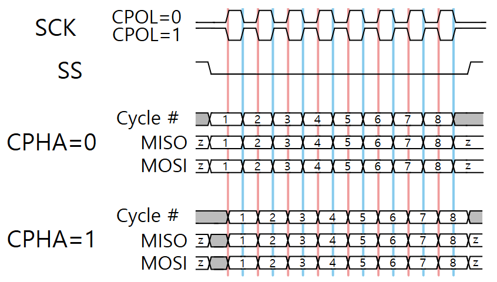
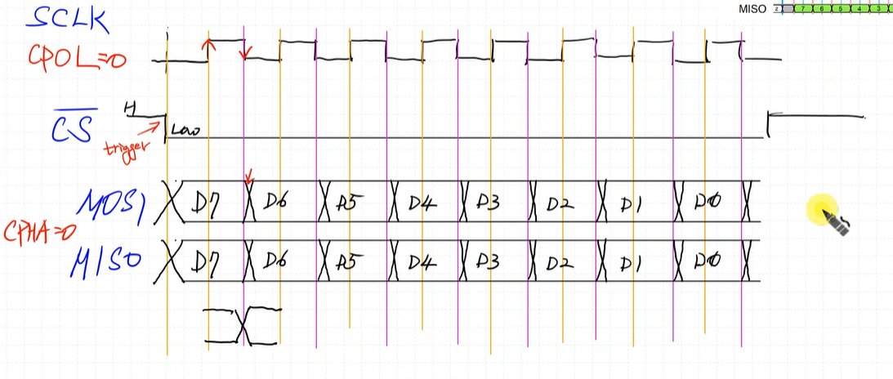
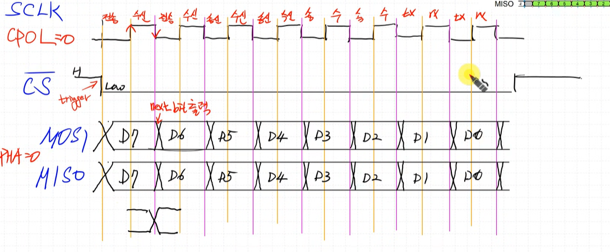
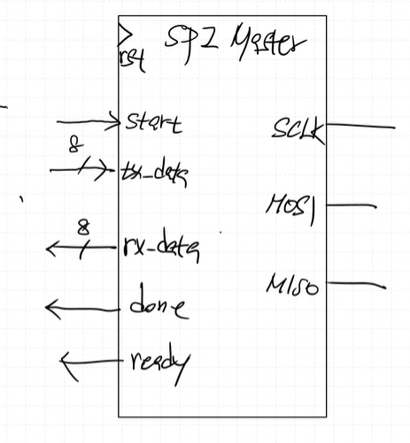

## SPI (Serial Peripheral Interface)
serial 통신, rx-tx 구조

### 신호선 구성 (4개)

- SCLK (CLK)  
- MOSI (Master Out Slave In)  
- MISO (Master In Slave Out)  
- CS (Chip Select, ***Active LOW***)  

### 특징
- synchronous 통신 방식 (master가 clk 생성)  
- Master <-> Slave 구조  
- 고속 통신 지원 (UART, I2C 에 비해 속도가 빠르다.)  
- 다중 장치 지원  
    - 하나의 Master가 여러 Slave와 통신 가능 (BUS)  
    - data broadcasting, chip select  

### 1 master multi slave 구조  

### data 전달

Master -> Slave 로 MSB 부터 전달  
-> Slave는 받은 bit를 shift 시켜야함 (MSB 부터 받았으니까)  

Master가 Slave에 `MOSI`로 7번째 bit 보낼 때 Slave에서도 7번째 bit를 `MISO`를 통해 보낸다.  

따라서 read할 때 Master 에서 Slave로 dummy data를 전송해야함 (master가 보내야 slave data가 나온다, 두 선이 동기화 되어 있음)  

# timing diagram

## CPOL과 CPHA
**CPOL(Clock Polarity)**  
`CPOL`이 0이면 clk 시작이 low, 1이면 clk 시작이 high  

**CPHA(Clock Phase)**  
`CPHA`이 1이면 sample 위치가 clk 1번째 edge 에서 sampling  
0이면 clk 2번째 edge 에서 sampling  

`CPOL`의 값에 따라서 rising edge인지 falling edge 인지 달라진다.  

## 가장 먼저 `CPOL`이 0, `CPHA`이 0인 경우를 구현해보자.

CPOL, CPHA가 0인 경우는 data가 clk negedge에서 나가는 경우.
clk 하강 에지를 본 후 data가 변화 -> delay 존재. 에지에서 바로 나가지 않는다.

### data 전송

MOSI는 data를 clk negedge에 송신
MISO는 data를 clk rising edge에 수신

### schematic

