## I2C(Inter-Integrated Circuit) 
아이 투 씨, 아이스퀘어씨, 아이아이씨

### 특징
- 직렬 통신
- 2 wire : SDA(Data), SCL(Clock)
- 동기식, half-duplex (동시에 송수신 불가)
- 풀업 저항 필요, 내부 회로가 open-drain 구조이다.

### 장단점
**장점**
- 단순하고 저렴함 (VCC, GND 빼면 실제 데이터 선은 2개 뿐이다: 연결이 너무 쉬움, 두 선(SDA, SCL) 만 있으면 bus로 여러 장치 연결 가능)
port(핀 수)는 곧 돈. 회로 만드는 비용이 내려간다.
- 다중 마스터가 지원이 되긴 하나 일반적으로는 단일 마스터를 사용한다.

**단점**
- 속도가 느리다. (최대 1MHz)
- 전송 거리가 짧다. (최대 1m)
I2C가 장거리용은 아니여서 장거리용으로 쓸려면 I2C를 쓰면 안됨

> 신호 손실을 줄이기 위한 전송 방식 : CAN 통신
CAN 통신은 노이즈에 강하다. (자동차 내부 회로에 많이 들어감)

---
### I2C Overview
> I2C is a two-wire serial communication protocol using a serial data line (SDA) and a serial clock line (SCL). 
The protocol supports multiple target devices on a communication bus and can also support multiple controllers that send and receive commands and data. Communication is sent in byte packets with ***a unique address for each target device.***

slave가 독립적으로 hw 적인 고유한 address를 가지고 있다. 

### I2C Speed mode
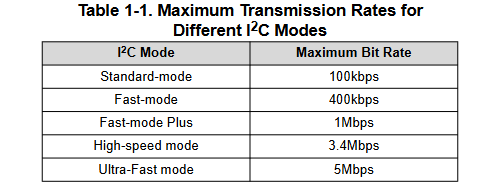
보통 Standard-mode와 Fast-mode를 많이 사용하나 Slave moduel의 data sheet에서 slave의 통신 최대 속도를 확인하고 적용해라
I2C는 slave를 쉽게 연동하기 위해 사용하는 것. (온습도 같이 느려도 되는거 위주로 사용, uart 보다는 빠르다)

### I2C Physical Layer
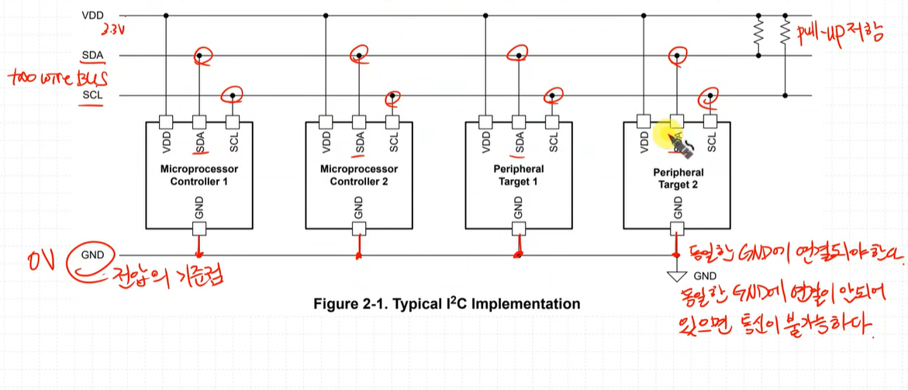

device 마다 모두 같은 GND 선에 연결해야 통신이 가능하다. (GND가 전압의 기준점. 기준점이 같아야한다.)

- two-wire bus (SDA, SCL)
data broadcasting
CS가 없음. -> 어떻게 slave를 구분?
각각의 hw적인 고유한 주소가 있어 그걸로 구분

---

## Open-Drain Connection
The open-drain connections are used on both SDA and SCL lines and connect to an NMOS transistor.

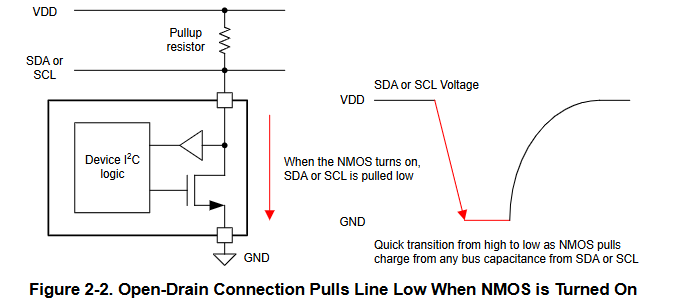
네모는 반도체 칩.
외부 전압 (drain)에 전압이 인가 되어있지 않기에 pull up 저항을 통해 전압을 걸어줘야 한다. (pull up 저항이 없으면 통신이 안된다.)

> 왜 open-drain으로 설계했을까?
open-drain이 아니라면 칩 하나에서 나오는 전류가 되게 약하다 (1mA 정도)
그러다 보니 선이 길어지거나 device가 많아지면 전압이 떨어져서 통신이 안된다.
하나의 port에 여러개를 붙일 때 전류가 떨어질 수있어 이런구조에서 open drain을 많이 쓴다. 

### Open-Drain ? 
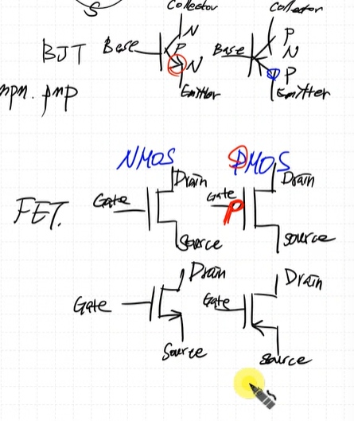

> 화살표가 달려있는게 Emiiter, Source

**예시**
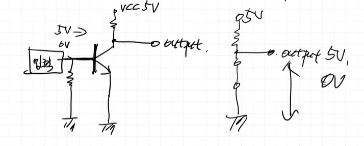
base에 0V, 5V 입력 시 각각 output

**Not gate 어떻게 만드는지? (switch)**
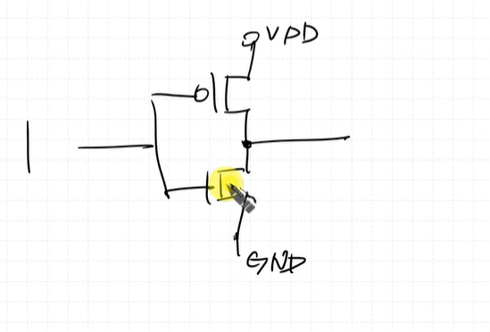

**open-drain / open-collector**
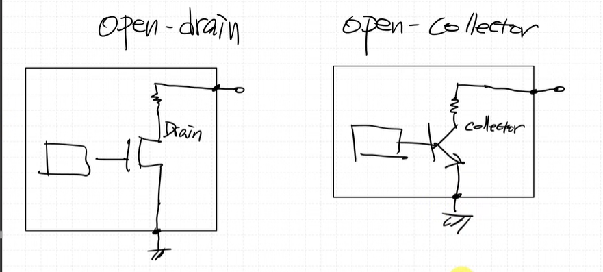
drain과 collector에 전압이 걸려있지 않고 open 되어 있다.
base or gate에 전압을 걸어주어도 출력값이 없기 때문에 output이 나가지 않음
> 따라서 pull up resistor를 사용하여 전압을 걸어주어야 한다.
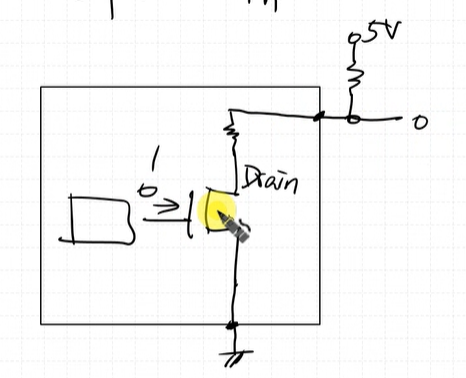
gate에 1을 주면 0, 0을 주면 1이나온다.

## I2C Protocol
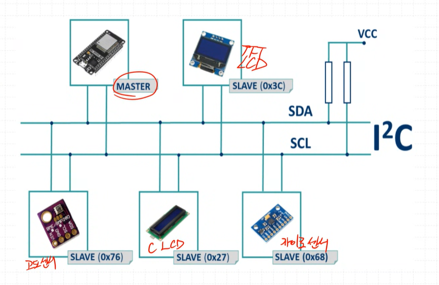
목적: 통신을 문제 없이 잘 하는 것
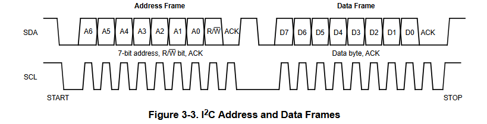
1. start signal을 보내면 모든 slave들이 주목 한다. 
2. address send -> 특정 slave 지목
3. data send
4. ACK -> slave가 data 수신했음을 알림
5. stop signal -> 통신 종료

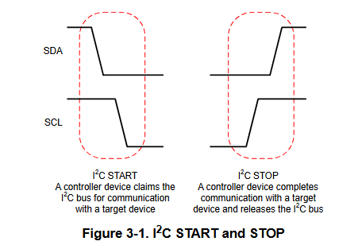

Burst 전송 가능. -> stop signal 보내지 않으면 계속 전송 가능
SPI는 CS 가 있음, I2C는 CS가 없음

1. start 신호가 broadcasting, 모든 slave가 받을 준비를 한다.
2. SLA(Slave Address) + R/W bit (총 7bit + 1bit = 8bit), 모든 slave는 address를 받고, 들어온 address와 자신의 address가 일치하는지 확인한 후 동작여부를 결정한다.
3. address가 일치하는 slave가 ACK를 보낸다.
4. stop 신호 받을 때 까지 slave들은 계속 대기, stop 신호를 받으면 모든 slave가 IDLE상태로 돌아간다.

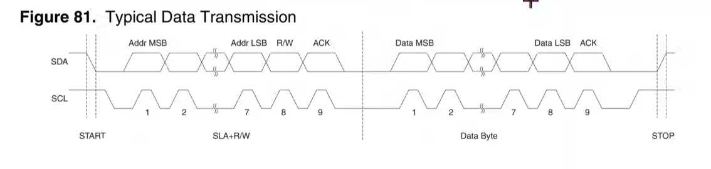

**slave의 주소는 chip 만드는 회사에서 정해져서 나온다.**
