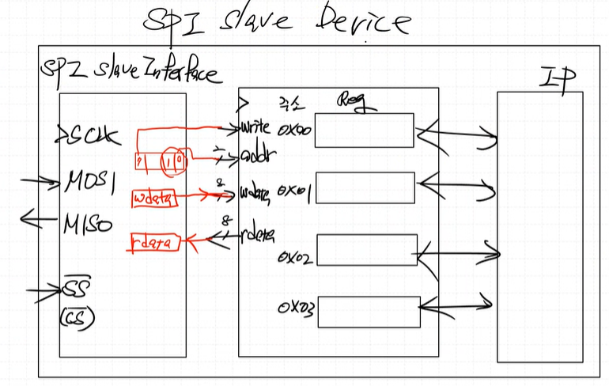

# 설계 방법
## SCLK 생성 logic

CPHA가 0일 때와 1일 때 차이점은 1일 때가 0일때의 반주기 delay 인것 밖에 없음

SPI mode 1은 SCLK이 low 일때 까지 delay 유지
SPI mode 3은 SCLK이 high 일때 까지 delay 유지

기본적으로 `CPOL == 0` 을 기준으로 `r_sclk`의 값을 정의하고, `CPOL == 1`이면 기존 `r_sclk` 값을 반전한다.

### SPI master simulation 결과
**CPOL = 0, CPHA = 0, Mode =0**  

state 1이 존재하지 않고 바로 CP0 CP1 상태가 나오는 것을 확인할 수 있다.  
delay X, CP1일 때 High.  

**CPOL = 0, CPHA = 1, Mode = 1**  
  
state 1이 존재하여 delay가 된 후 CP0 CP1 상태가 번갈아 나가는 것을 확인할 수 있다.  
delay 존재, CP0일 때 High.  

**CPOL = 1, CPHA = 0, Mode = 2**  
  
delay X, CP0 일 때 High

**CPOL = 1, CPHA = 1, Mode = 3**  
  
delay 존재, CP1 일 때 High.  

## SPI Slave mode 설정하기
slave에 따라 mode 설정이 다르고 정해져있다.  
Slave에서 CPHA, CPOL을 설정하는 경우는 없다(고정되어서 나온다.)   
slave에 따라서 master가 알맞는 CPHA, CPOL을 설정해야 한다.  

- ex 1) mt41t93의 경우 CPOL=0, CPHA=0으로 설정하는 slave임  
  

ex) rtc register map (시계 칩이다!.. 근데 SPI를 사용하는..)  
  

# 상용 spi doc 참고하여 spi slave 설계 (rtc chip)
  
addr의 MSB를 보고 read mode인지 write mode인지 결정한다.  
- 1이면 write mode, 0이면 read mode

## write/read mode 
### read mode
  
주소를 받고, 그 다음 해당 주소의 data를 보낸다.  
read시 dummy data를 보내야 하는데, read mode 일 때는 dummy data를 저장하면 안된다.  

**read state machine**

### write mode
  
SPI slave에 register 들이 존재하고, master가 write 하기 위해 register를 select 해야한다.  
따라서 먼저 주소를 보내고, 그 다음 data를 보낸다.  

  
사실 write mode에서 쓰기와 읽기가 동시에 일어나게 된다.  
(주소를 보내고, SDO로 data가 들어오니까)  

**write state machine**

## SPI slave Device 모듈 설계
  
IP가 위에 참고한 상용칩처럼 rtc가 될수도 있고, mt41t93처럼 memory chip이 될수도 있다. (설계하기 나름)  

- register addr
총 4개의 register가 존재하고, 각각의 register는 8bit이다.   
들어오는 addr의 MSB를 통해 read/write mode 결정하고, LSB 쪽 2 bit은 reigster address로 사용한다.  

- register write data
addr의 MSB가 1인 경우, 2번째 들어오는 data부터 저장한다.  

- register read data
