**AXI와 APB 차이** (면접)
APB는 half-duplex (전송 or 수신만 가능 (동시 불가))
AXI는 full-duplex (전송 수신 **동시에** 가능)

APB 는 bus (broadcasting -> address, data line이 모든 peripheral에 연결되어 select 신호로 동작시킴)
AXI는 point to point (bus X, channel이 각각 따로 존재. 따라서 wirte와 read 동시에가능하나 bandwidth가 더 늘어날 수 있다.)

"Valid-Ready handshake"

**AMBA protocol 의 역사**
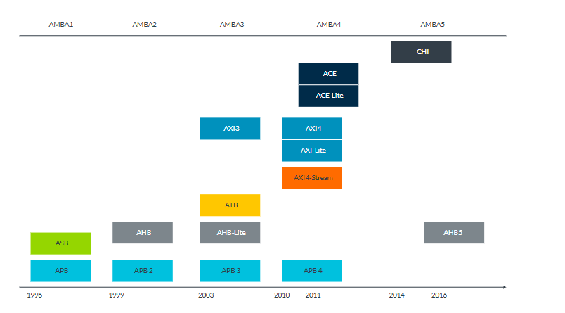
AXI4, AXI-Lite를 가장 많이 쓴다.

### AXI document
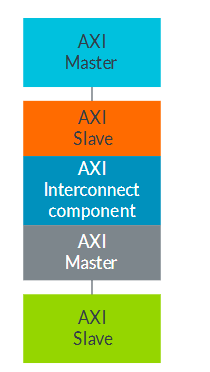

AXI Master - interconnect - AXI Slave

[multi-master system]
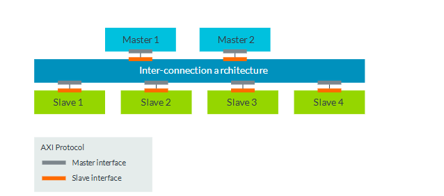
master가 여러개가 될 수 있다.

"The AXI protocol defines the signals and timing of the point-to-point connections between masters and slaves"
"The AXI protocol is a point-to-point specification, not a bus specification." 
-> bus spec이 아니고 point-to-point spec이다. 

[AXI channels]
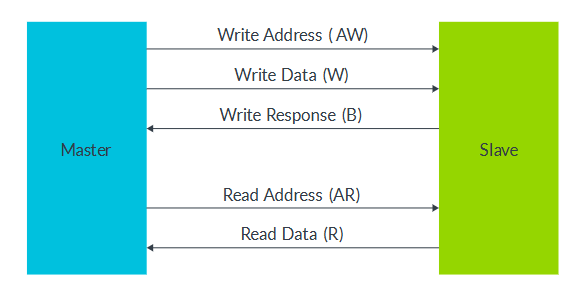
각 pheripheral 마다 각각의 독립적인 channel(port)가 따로 존재한다.

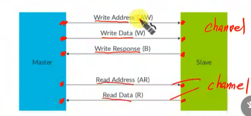
이렇게 AW, W, B, AR, R 이 pheripheral마다 따로 존재한다. (공유 X)

APB 에서도 AXI 에서도 master가 slave를 바라볼 때 mem 처럼 바라본다.

각 channel은 unidirectional 이다.(방향이 정해져있다)

"There is no timing relationship between the groups of read and write channels." -> write, read 동시 가능

### channel handshake
모든 channel에 valid와 ready signal이 존재한다.
source가 valid, destination이 ready
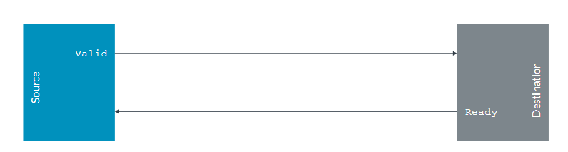

valid : source -> destination
ready: destination -> source

비동기 handshake가 아니고, clk 신호에 맞춰서 동작해야한다.

### transfer와 transaction의 차이점
transfer는 channel에 대한 신호를 주고 받는다.
transaction은 모든 transfer을 의미한다.
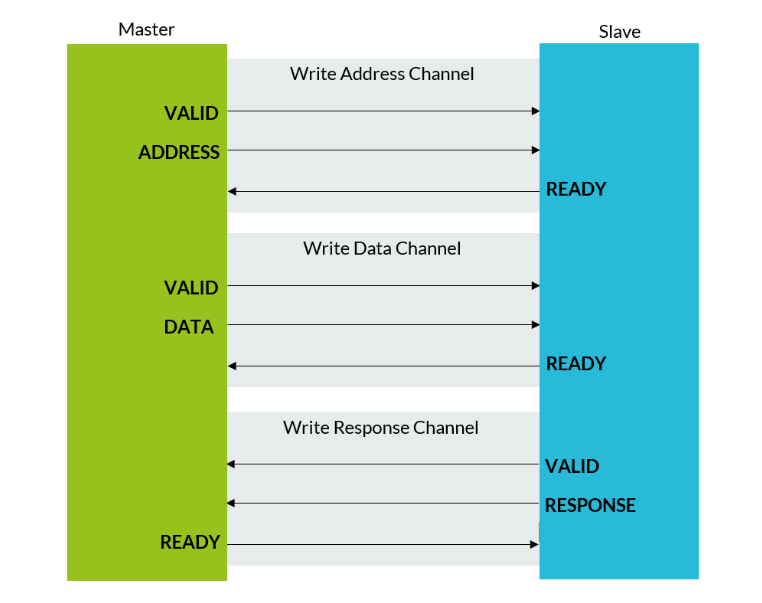

"valid-ready handshake"

### channel transfer example
timing diagram을 참고하여 구현해보자
- info, valid 띄우고 Ready 띄우는 경우
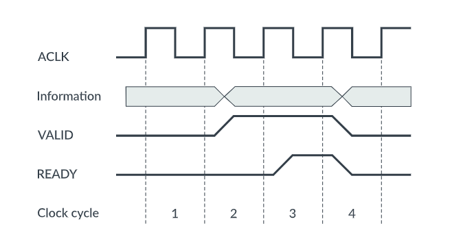
This example has the following sequence of events:
1. In clock cycle 2, the VALID signal is asserted, indicating that the data on the information channel is valid.
2. In clock cycle 3, the following clock cycle, the READY signal is asserted.
3. The handshake completes on the rising edge of clock cycle 4, because both READY and VALID signals are asserted.
The following diagram shows another example:

- Ready를 먼저 띄우고 info, valid 띄우는 경우
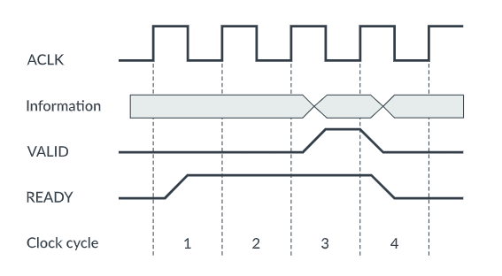
This example has the following sequence of events:
1. In clock cycle 1, the READY signal is asserted.
2. The VALID signal is not asserted until clock cycle 3.
3. The handshake completes on the rising edge of clock cycle 4, when both VALID and READY are asserted

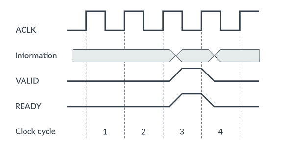
The final example shows both VALID and READY signals being asserted during the clock cycle 3, as seen in the following diagram:

Again, the handshake completes on the rising edge of clock cycle 4, when both VALID and READY are asserted.
In all three examples, information is passed down the channel when READY and VALID are asserted on the rising edge of the clock signal.
Read and write handshakes must adhere to the following rules:
• A source cannot wait for READY to be asserted before asserting VALID.
• A destination can wait for VALID to be asserted before asserting READY.
These rules mean that READY can be asserted before or after VALID, or even at the same time

---
기존 구조: BUS
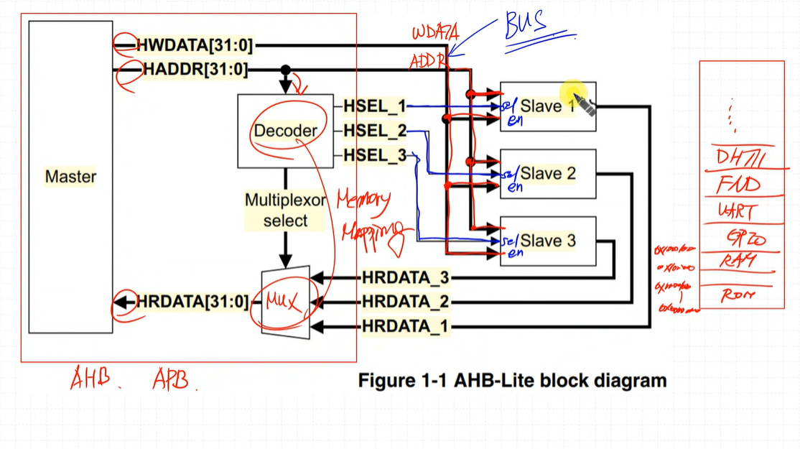

Data와 addr선이 물리적으로 연결되어 있고 broadcasting된다. (bus)
selection 신호로 slave를 선택하고, 선택된 slave만 동작한다. (선택하는 방법은 pheripheral을 memory map 으로 할당하고, 할당된 주소로 접근)

AXI는 bus 구조가 아니다. (point to point)
broadcasting 이 아닌 point to point (broadcasting <-> point to point)

broadcasting 방식이 아니기에 master1이 slave와 통신중일 때 master 2가 다른 slave와 통신 가능.
Inter-connection architecuture -> switch 역할을 한다. (우리가 구현을 하지는 않고 micro blaze에서 구현된걸 사용할 것)

bus X, channel
write 용 channel (AW, W B ) -> 얘넬 합쳐서 "write transcation"
read용 channel(AR, R) -> 얘넬 합쳐서 "read transaction"
write 할 때 전용 통로가 있다 생각할 것

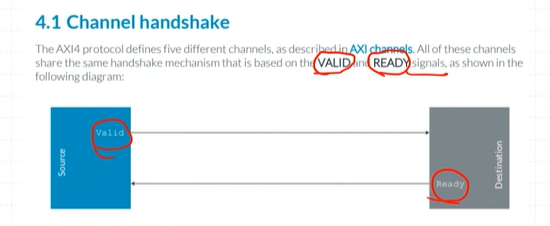
5개의 channel이 있는게 특징,
and channel 안에 모든 channel 마다 valid, ready라는 signal이 존재.
**valid**: source 쪽에서 보내는 신호, **information과 함께 보낸다.**
ready: 
1. 이 valid한 information을 잘 처리했다.
2. 이 valid한 information 받을 준비가 되어있다.

handshake: valid, ready가 동시에 high가 되는 순간.
이 순간을 "handshaking이 일어났다"라고 한다.
해당 채널에 대해서 동작이 완료됐다. 고 해석
각 채널마다 valid-ready handshaking이 일어난다.

---
write data Ready -> AWVALID 가 high 여서 data가 들어올 것을 기대할 수 있으니 이때 WREADY를 띄운다.
[channel transfer exmaples]
1. 처리했다는 의미의 ready
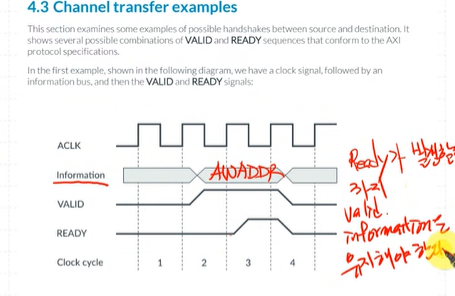
Ready가 high 되기까지 information과 valid를 유지할 것
-> valid받고 ready 띄울 때는 valid 를 최소 2clk 유지 해야한다.

2. 받을 준비가 되어있다는 의미의 ready
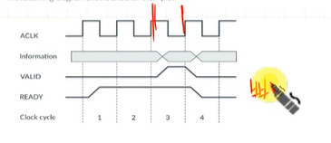
-> valid를 1clk 만 유지 -> 빠르게 처리 가능
빠르게 처리하기 위해 Ready가 먼저 asserted됨

3. valid ready 동시에 high
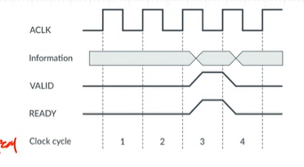
조합회로인 경우, 보통 사용 X

---
전체 timing diagram
1. wrtie transaction
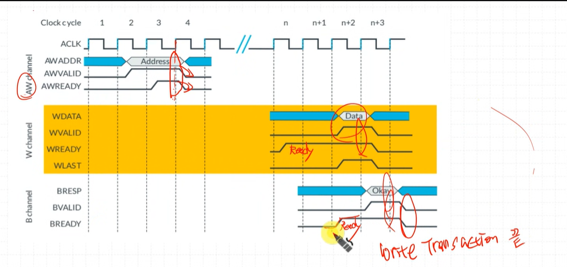
AWChannel -> handshaking 확인 후 바로 low 떨어짐

Wchannel -> read 먼저 띄워놓음

w channel handshaking 이 일어나자마자 bready high로 설정
B valid ready handshaking 일어나고나면 write transaction 종료 -> 이후 다음 transaction 이 가능하게됨

2. read transaction
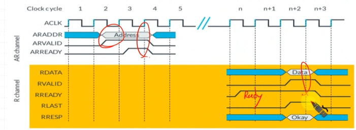
RDATA와 함께 response값(`okay`)을 준다.

--
handshake depedencies
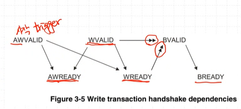
화살촉이 하나는 1,2 ready 어떤 종류로 해도 상관 X
화살촉 2개는 항상 처리된 이후에 발생해야함
BValid는 항상 Wvalid, wready가 발생한 후 발생해야함.

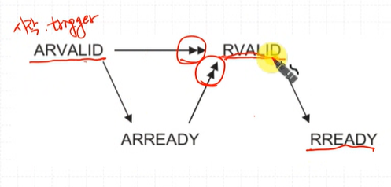
RVALID는 Address valid ready handshaking이 일어난 후에 발생해야함.
