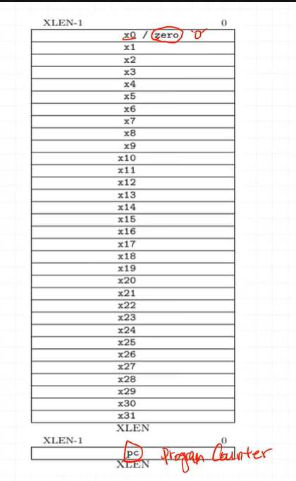
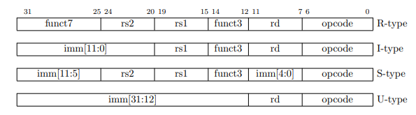
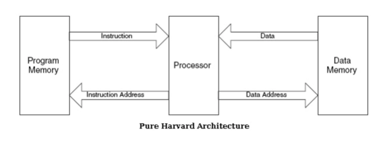

- RF

    - GPR (General Purpose Register)
    
    > ABI name은 C언어로 컴파일할때 나오는 이름?
    > 똑같은건데 할당만 해놓은거라고 함

- 명령어 type

- CPU 기본 모듈 (하버드 구조)
    
    - PC (program counter)
    - instruction mem(ROM, FLASH): read only memory
    - Register File
    - ALU
    - Data Mem (RAM)

