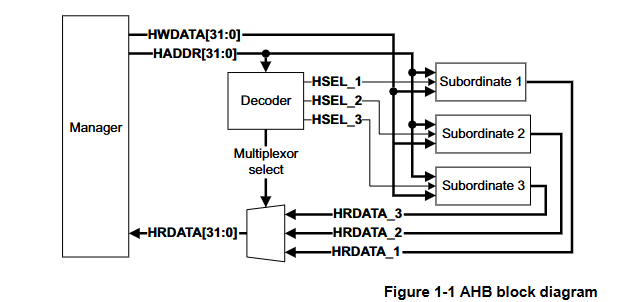
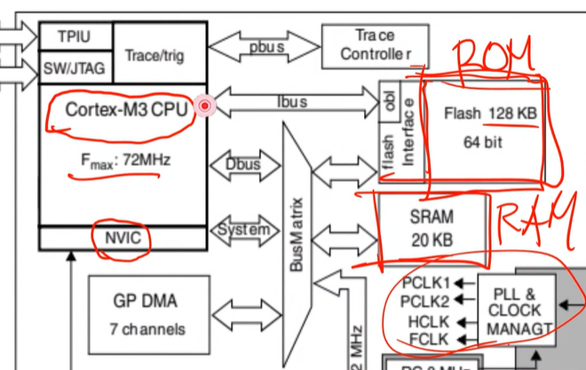
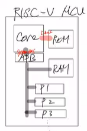
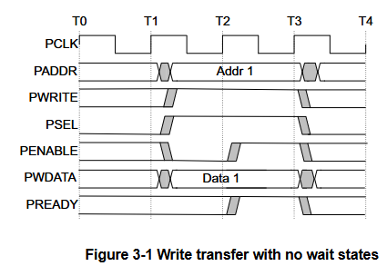
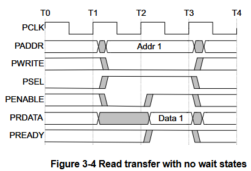
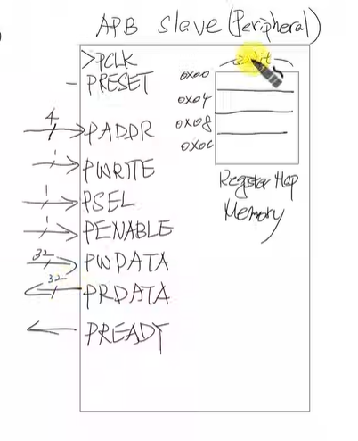

- schematic

## RISC-V MCU
Havard 구조라서 CPU와 ROM, RAM이 따로 존재한다.

ibus: Core <-> ROM
systembus: Core <-> APB

### APB Master
- state diagram

- 임시저장소를 사용하여 addr, wdata 저장
상태가 IDLE-> SETUP으로 바뀌기전에 신호가 바뀔 수 있다.
따라서 IDLE 상태에서 trasnfer sig가 올때 addr, wdata를 임시저장소에 저장해 준 후 
SETUP 상태에서 그 임시저장소에 저장된 데이터를 가져온다.

- write

- read

### APB_Decoder
**Address Map**
Memory Map을 해보자
현재 32bitAddress를 사용하고 있음 -> 4GB의 주소를 사용할 수 있다.

- 0x0000_0000 ~ 0x0000_0FFF : ROM 영역
- Reserved 영역
- 0x1000_0000 ~ 0x1000_0FFF : RAM 영역
- 0x1000_1000 ~ 0x1000_1FFF : P1 영역
- 0x1000_2000 ~ 0x1000_2FFF : P2 영역
...

Decoder를 통해 peripheral에 chip select 신호를 인가한다.
APB 내부적으로는 chip enable이 high일때만 동작한다.

### APB_Mux
select된 Slave의 Rdata와 ready 신호를 동시에  Master에 전달한다.
ready가 1일때 cpu가 해당 rdata를 읽는다

### APB Slave (peripheral)

peripheral에 Register Map memory가 있다 (0x00~0x0c) -> 따라서 paddr은 4bit(0~15)로 설정

