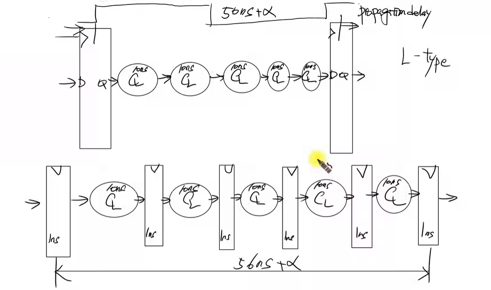
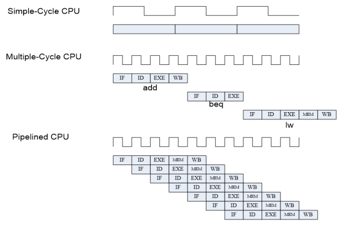

- single cycle의 한계

 가장 긴 cycle은 SW/LW(L-type)<

PC-> ROM으로 addr 전송
ROM이 instruction을 regfile과 cu에 전달
CU가 instruction을 decoding하여 controlSignal 생성
sw일 경우 alu 연산 후 ram에 저장

> 1 clk을 쪼개면 어떨까? 
더 빨라질 수 있으나 명령어에 따라 다르다
L-type의 경우 가장 긴 사이클을 갖고, R-type이 가장 짧은 사이클을 갖는다.

> single cycle의 경우 모든 명령어가 같은 사이클을 갖는다.
명령어에 따라 CLK 수를 다르게 하자

- multi cycle
> stage를 5단계로 나눈다. (기존 동작 clk을 5로 쪼갠다)
Fetch-> Decode-> Execute-> MemAccess-> WriteBack
clk을 5로 나눈다

 개별 단계 설명 

1. Fetch: 명령어 인출 (PC <-> ROM)
2. Decode: 명령어 해독(분석) (Controlunit signal 생성)
3. Execute: ALU 연산
4. MemAccess: 메모리(RAM) 접근
5. WriteBack: 결과 레지스터에 기록 (RAM -> 레지스터로 Read data 이동)

 multi cycle이라고 모두 signle cycle보다 짧진 않다

ff 자체의 dealy가 있기 때문에 L-type의 경우 single cycle보다 더 긴 사이클을 가질 수 있다.

