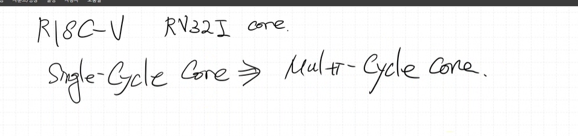

지금까지 Risc-v RV32I core single-cycle core를 설계했다.

"basic base core" 설계한 것
> 이제 문서화 해야한다.
ppt 작성, 발표

ppt 작성 기준
1. 표지: 제목, 작성자이름
2. RISC-V 개요
3. 구현환경 언어 simulation tool (버디를 써봐야 한다? 버디는 코드의 break point 잡아준다 함 ...)
4. type 별 설명 (L, I, R...)
5. type 별 상세 설계(구현) 내용, 검증 내용(모든 명령어 검증)
6. !중요! 느낀점
- 내가 배운 점, 변화된 점
- 설계하면서 어려웠던 점, 해결 방안

다음부터는 multi-cycle core 설계 + 버스 설계 할 것
